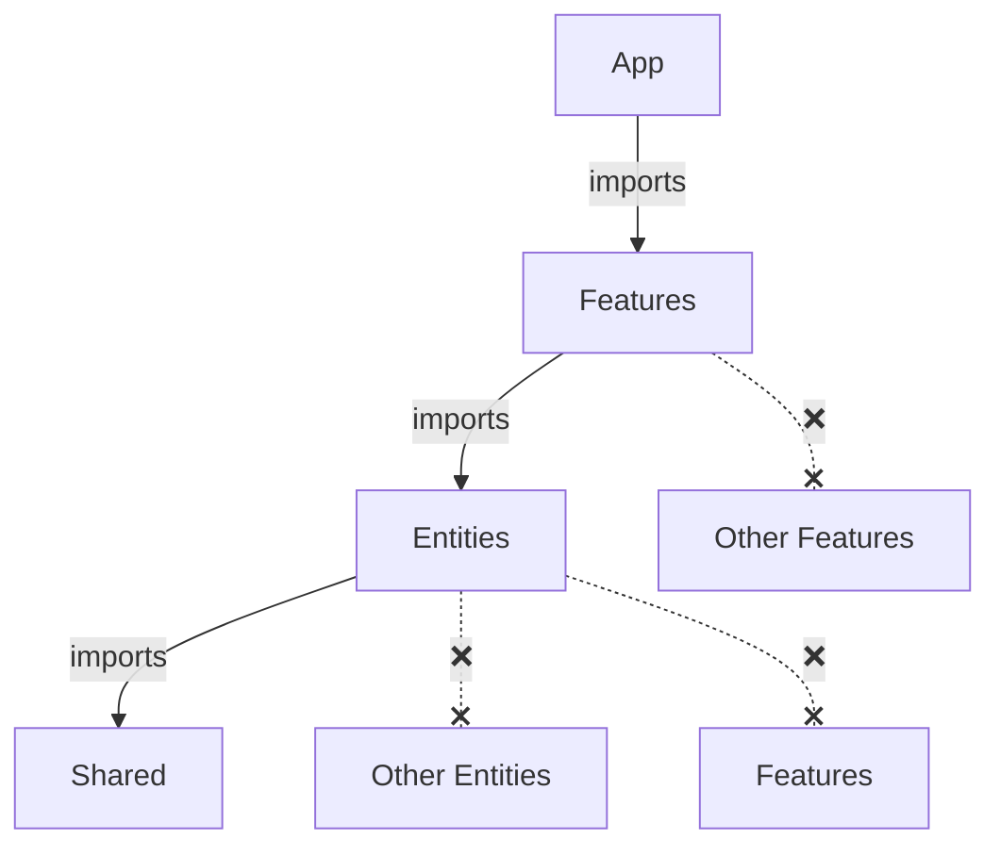

# 🤖 FAA — Rules for AI/LLM Agents

> This document describes how an AI agent should write, organize, and refactor code in a project using Feature-Action Architecture (FAA).

If you're an AI working with an FAA codebase — **read this first**.

> [!NOTE]
> Examples in this document use TypeScript and a functional style (no classes). DI examples are shown **for example** with `typed-inject`.

---

## 📖 Table of Contents

- [Architecture Overview](#-architecture-overview)
- [Layer Rules](#-layer-rules)
- [Creating a New Feature](#-creating-a-new-feature)
- [Creating a New Entity](#-creating-a-new-entity)
- [Code Patterns](#-code-patterns)
- [File Naming](#-file-naming)
- [Dependency Injection](#-dependency-injection)
- [Where to Put Code — Decision Tree](#-where-to-put-code--decision-tree)
- [Import Rules](#-import-rules)
- [Anti-Patterns — What NOT to Do](#-anti-patterns--what-not-to-do)
- [Refactoring Guide](#-refactoring-guide)
- [Checklist](#-checklist)

---

## 🏗️ Architecture Overview

FAA has **4 layers**, strict top-to-bottom dependency flow:

```
src/
├── app/          → Assembly: DI container, router, server init
├── features/     → Business use cases (actions, handlers, feature-specific queries)
├── entities/     → Domain data (models, CRUD, reusable domain logic)
└── shared/       → Infrastructure & utilities (logger, DB drivers, pure helpers)
```



> [!IMPORTANT]
> **NEVER** import upward or horizontally between same-level modules. This is the #1 rule.

---

## 📏 Layer Rules

### App Layer (`app/`)

| Aspect | Rule |
|---|---|
| **Purpose** | Wire everything together. Create DI container, register routes, start server. |
| **Can import from** | Features, Entities, Shared |
| **Contains** | `container.ts`, `routes.ts`, `server.ts`, `factory.ts`, `context.ts`, `cors.ts` |
| **Should NOT contain** | Business logic, DB queries, domain types |

### Features Layer (`features/`)

| Aspect | Rule |
|---|---|
| **Purpose** | Implement business use cases. Each feature = one slice of functionality. |
| **Can import from** | Entities, Shared |
| **CANNOT import from** | Other Features, App |
| **Contains** | Actions (`.action.ts`), HTTP handlers (`api/`), feature-specific queries (`db/`), local helpers (`lib/`), types |

### Entities Layer (`entities/`)

| Aspect | Rule |
|---|---|
| **Purpose** | Own domain data. Provide CRUD and reusable domain logic. |
| **Can import from** | Shared only |
| **CANNOT import from** | Other Entities, Features, App |
| **Contains** | Model (`model.ts`), DAL (`dal.ts`), domain logic (`lib/`), cache (`cache.ts`), types |

### Shared Layer (`shared/`)

| Aspect | Rule |
|---|---|
| **Purpose** | Provide infrastructure and pure utilities. |
| **Can import from** | Nothing above (only external packages) |
| **Contains** | `api/` (HTTP primitives), `lib/` (pure functions), `infra/` (drivers, config, logger) |
| **Should NOT contain** | Business logic, domain types |

---

## 🆕 Creating a New Feature

When you need to add a new feature (business use case), follow this template:

### Step 1: Create the directory structure

```
features/{feature-name}/
├── api/
│   └── handler.ts
├── {name}.action.ts
├── types.ts
└── index.ts
```

Add `db/` and `lib/` only if needed.

### Step 2: Write the Action

```typescript
// features/{name}/{verb}.action.ts

type Deps = {
  // List entity DALs and shared services this action needs
  userDal: ReturnType<typeof createUserDal>;
  config: AppConfig;
};

export const create{Name}Action = (deps: Deps) =>
  async (input: InputType): Promise<OutputType> => {
    // 1. Fetch data from entities
    const user = await deps.userDal.findById(input.userId);

    // 2. Apply business rules
    if (!user) throw new AppError("User not found", 404);

    // 3. Perform operations
    const result = await deps.userDal.update(user.id, input.changes);

    // 4. Return result
    return result;
  };
create{Name}Action.inject = ["userDal", "config"] as const;
```

### Step 3: Write the Handler

```typescript
// features/{name}/api/handler.ts

export const create{Name}Handler = (action: ReturnType<typeof create{Name}Action>) =>
  async (req: Request): Promise<Response> => {
    // Parse request
    const input = await req.json();

    // Call action
    const result = await action(input);

    // Return response
    return Response.json({ data: result });
  };
create{Name}Handler.inject = ["{name}Action"] as const;
```

### Step 4: Write the index.ts

```typescript
// features/{name}/index.ts
export { create{Name}Action } from "./{name}.action";
export { create{Name}Handler } from "./api/handler";
```

### Step 5: Register in App (typed-inject)

```typescript
// app/container.ts — add to DI container
import { createInjector } from "typed-inject";

export const createContainer = () => {
  return createInjector()
    .provideFactory("userDal", createUserDal)
    .provideFactory("loginAction", createLoginAction)
    .provideFactory("loginHandler", createLoginHandler);
};
```

---

## 🆕 Creating a New Entity

When you need a new domain data model:

### Step 1: Create the directory structure

```
entities/{entity-name}/
├── model.ts
├── dal.ts
└── types.ts
```

Add `lib/` and `cache.ts` only if needed.

### Step 2: Define the Model

```typescript
// entities/{name}/model.ts
import { Schema, model } from "mongoose";

interface IEntity {
  field1: string;
  field2: number;
  created_at: Date;
}

const schema = new Schema<IEntity>({
  field1: { type: String, required: true },
  field2: { type: Number, required: true },
  created_at: { type: Date, default: Date.now },
});

export const EntityModel = model<IEntity>("Entity", schema);
export type { IEntity };
```

### Step 3: Create the DAL

```typescript
// entities/{name}/dal.ts
import { EntityModel } from "./model";

export const createEntityDal = () => ({
  findById: (id: string) =>
    EntityModel.findById(id).lean(),

  create: (data: Partial<IEntity>) =>
    EntityModel.create(data),

  update: (id: string, data: Partial<IEntity>) =>
    EntityModel.findByIdAndUpdate(id, data, { new: true }).lean(),

  delete: (id: string) =>
    EntityModel.findByIdAndDelete(id),
});
```

### Step 4: Add domain logic if needed

```typescript
// entities/{name}/lib/queries.ts — complex reads
export const createEntityQueries = (dal: ReturnType<typeof createEntityDal>) => ({
  getOrCreate: async (uniqueField: string) => {
    const existing = await dal.findById(uniqueField);
    if (existing) return existing;
    return dal.create({ field1: uniqueField });
  },
});
```

---

## 📝 Code Patterns

### Action Factory Pattern

```typescript
// The STANDARD way to create an action

type {Name}ActionDeps = {
  entityDal: ReturnType<typeof createEntityDal>;
  // ... other dependencies
};

export const create{Name}Action = (deps: {Name}ActionDeps) =>
  async (input: InputType): Promise<OutputType> => {
    // orchestration logic
  };
```

### Handler Pattern

```typescript
// Handlers are THIN — parse, delegate, respond

export const create{Name}Handler = (action: ActionFn) =>
  async (req: Request): Promise<Response> => {
    const input = parseRequest(req);     // parse
    const result = await action(input);  // delegate
    return formatResponse(result);       // respond
  };
```

### Feature-Specific Query Pattern

```typescript
// features/{name}/db/pipelines.ts
// Complex queries that only THIS feature needs

import { SomeModel } from "@/entities/some/model";

export const getComplexData = (params: Params) =>
  SomeModel.aggregate([
    { $match: { /* ... */ } },
    { $group: { /* ... */ } },
    { $sort: { /* ... */ } },
  ]);
```

### Entity DAL Pattern

```typescript
// ONLY generic CRUD. No business logic. No complex queries.

export const createEntityDal = () => ({
  findById: (id) => Model.findById(id).lean(),
  findMany: (filter) => Model.find(filter).lean(),
  create: (data) => Model.create(data),
  update: (id, data) => Model.findByIdAndUpdate(id, data, { new: true }).lean(),
  delete: (id) => Model.findByIdAndDelete(id),
});
// If DAL needs external deps, add inject tokens:
// createEntityDal.inject = ["mongo"] as const;
```

### Entity Lib Pattern

```typescript
// Reusable domain logic — used by MULTIPLE features

// entities/{name}/lib/queries.ts — complex reads
export const getOrCreate = async (field: string) => { /* ... */ };

// entities/{name}/lib/commands.ts — complex writes
export const deactivate = async (id: string) => { /* ... */ };

// entities/{name}/lib/helpers.ts — pure functions
export const normalize = (value: string): string => { /* ... */ };
```

---

## 📁 File Naming

| Element | Pattern | Example |
|---|---|---|
| Action file | `{verb}.action.ts` | `login.action.ts`, `generate.action.ts` |
| Action factory | `create{Name}Action` | `createLoginAction`, `createGenerateAction` |
| Handler file | `handler.ts` inside `api/` | `features/auth/api/handler.ts` |
| Handler factory | `create{Name}Handler` | `createLoginHandler` |
| Entity DAL factory | `create{Name}Dal` | `createUserDal` |
| Entity model file | `model.ts` | `entities/user/model.ts` |
| Entity DAL file | `dal.ts` | `entities/user/dal.ts` |
| Entity cache file | `cache.ts` | `entities/user/cache.ts` |
| Feature DB queries | `pipelines.ts`, `queries.ts` | `features/race/db/pipelines.ts` |
| Types file | `types.ts` | `features/auth/types.ts` |
| Public API | `index.ts` | `features/auth/index.ts` |
| Feature-local helpers | `helpers.ts` inside `lib/` | `features/auth/lib/helpers.ts` |

> [!TIP]
> Action files use the **verb** as the name: `login`, `generate`, `get-profile`, `update-privacy`.
> Not nouns: ~~`auth.action.ts`~~, ~~`user.action.ts`~~.

---

## 🔌 Dependency Injection

### Factory DI (Recommended, with typed-inject)

Every action, handler, and entity DAL is created through a factory that explicitly declares its dependencies:

```typescript
// Declaration
export const createSomeAction = (deps: { userDal, config }) =>
  async (input) => { /* uses deps.userDal, deps.config */ };
createSomeAction.inject = ["userDal", "config"] as const;

// Wiring (in app/container.ts)
const container = createInjector()
  .provideValue("config", config)
  .provideFactory("userDal", createUserDal)
  .provideFactory("someAction", createSomeAction);
```

### Container Pattern

```typescript
// app/container.ts
import { createInjector } from "typed-inject";

export const createContainer = async () => {
  // 1. Shared (infra)
  const config = await loadConfig();
  const mongo = await connectMongo(config);

  // 2. Entities (depend on Shared)
  const container = createInjector()
    .provideValue("config", config)
    .provideValue("mongo", mongo)
    .provideFactory("userDal", createUserDal)
    .provideFactory("cockDal", createCockDal)

    // 3. Features (depend on Entities + Shared)
    .provideFactory("loginAction", createLoginAction)
    .provideFactory("generateSizeAction", createGenerateSizeAction)

    // 4. Handlers (depend on Actions)
    .provideFactory("loginHandler", createLoginHandler)
    .provideFactory("sizeHandler", createSizeHandler);

  return container;
};
```

> [!IMPORTANT]
> The container follows the same layer order: Shared → Entities → Features → Handlers.
> This is not a coincidence — it mirrors the dependency flow.

---

## 🗺️ Where to Put Code — Decision Tree

Follow this when deciding where new code belongs:

```
Is it a pure utility (datetime, math, encoding)?
  → shared/lib/

Is it infrastructure (DB driver, logger, config)?
  → shared/infra/

Is it an HTTP primitive (error class, response helper, middleware)?
  → shared/api/

Is it a DB schema/model?
  → entities/{name}/model.ts

Is it generic CRUD for one entity?
  → entities/{name}/dal.ts

Is it reusable domain logic for one entity?
  → entities/{name}/lib/

Is it a complex query needed by only one feature?
  → features/{name}/db/

Is it business orchestration (calling multiple entities)?
  → features/{name}/{verb}.action.ts

Is it an HTTP handler?
  → features/{name}/api/handler.ts

Is it a response/request type for one feature?
  → features/{name}/types.ts
```

---

## 🚫 Import Rules

### ✅ Allowed Imports

```typescript
// Feature → Entity ✅
import { createUserDal } from "@/entities/user";

// Feature → Shared ✅
import { formatDate } from "@/shared/lib/datetime";
import { AppError } from "@/shared/api/errors";

// Entity → Shared ✅
import { moscowNow } from "@/shared/lib/datetime";

// App → Feature ✅
import { createLoginAction } from "@/features/auth";

// App → Entity ✅
import { createUserDal } from "@/entities/user";
```

### ❌ Forbidden Imports

```typescript
// Feature → Feature ❌ NEVER
import { something } from "../other-feature";
// Fix: move shared logic to an Entity or Shared

// Entity → Entity ❌ NEVER
import { UserModel } from "../user/model";
// Fix: do the join in the Feature action

// Entity → Feature ❌ NEVER (upward)
import { loginAction } from "@/features/auth";

// Shared → Entity ❌ NEVER (upward)
import { UserModel } from "@/entities/user/model";

// Shared → Feature ❌ NEVER (upward)
import { createLoginAction } from "@/features/auth";
```

> [!CAUTION]
> When you see a horizontal or upward import — **STOP**. Refactor before proceeding.
> Move shared logic down to the appropriate layer.

---

## 🚫 Anti-Patterns — What NOT to Do

### ❌ God Action (too many responsibilities)

```typescript
// BAD
export const createMonsterAction = (deps) =>
  async (userId) => {
    // auth logic (50 lines)
    // profile logic (50 lines)
    // notification logic (50 lines)
    // analytics logic (50 lines)
  };
```

**Fix:** Split into separate actions in separate features.

---

### ❌ Business Logic in DAL

```typescript
// BAD
export const createUserDal = () => ({
  register: async (data) => {
    const passwordHash = await bcrypt.hash(data.password); // ❌ business logic
    const user = await UserModel.create({ ...data, password: passwordHash });
    await sendWelcomeEmail(user.email); // ❌ side effect
    return user;
  },
});
```

**Fix:** DAL only does `create`. Hashing and emailing happen in the action.

---

### ❌ Handler with Business Logic

```typescript
// BAD
export const createHandler = () =>
  async (req: Request) => {
    const body = await req.json();
    const user = await UserModel.findById(body.id); // ❌ direct DB access
    if (user.role !== "admin") throw new Error("Forbidden"); // ❌ business logic
    await UserModel.updateOne({ _id: body.id }, { active: false }); // ❌ direct DB access
    return Response.json({ ok: true });
  };
```

**Fix:** Handler calls action. Action does the work.

---

### ❌ Shared Code Between Features (horizontal dependency)

```typescript
// features/dashboard/dashboard.action.ts
import { formatProfile } from "../user-profile/lib/helpers"; // ❌ horizontal import
```

**Fix:** Move `formatProfile` to `entities/user/lib/helpers.ts`.

---

### ❌ Creating Global Barrel Exports

```typescript
// DON'T create things like:
// entities/index.ts that re-exports all entities
// features/index.ts that re-exports all features
```

**Fix:** Import from specific entity/feature: `@/entities/user`, `@/features/auth`.

---

## 🔄 Refactoring Guide

When refactoring existing code to FAA:

### Moving a Service method → Action

1. Identify what the method does (one use case = one action)
2. Create `features/{name}/{verb}.action.ts`
3. Extract dependencies into the factory parameter
4. Move feature-specific queries to `features/{name}/db/`
5. Move reusable entity logic to `entities/{name}/lib/`
6. Create a thin handler in `features/{name}/api/handler.ts`
7. Wire in `app/container.ts` and `app/routes.ts`

### Moving a Repository → Entity DAL

1. Identify generic CRUD operations → `entities/{name}/dal.ts`
2. Identify reusable domain logic → `entities/{name}/lib/`
3. Identify feature-specific queries → `features/{name}/db/`
4. Delete the repository file

### Splitting a God Service

1. List all methods in the service
2. Group by business use case (each group = one feature)
3. Create a feature directory for each group
4. Move each method into its own `.action.ts`
5. Extract shared entity logic into `entities/{name}/lib/`

---

## ✅ Checklist

Before considering a task done, verify:

- [ ] No upward imports (entity → feature, shared → entity)
- [ ] No horizontal imports (feature → feature, entity → entity)
- [ ] Every feature has `index.ts` with public API
- [ ] Actions receive dependencies via factory parameters (no hidden globals)
- [ ] Handlers are thin (parse → delegate → respond)
- [ ] DAL contains only generic CRUD (no business logic)
- [ ] Feature-specific queries live in `features/{name}/db/`
- [ ] Reusable domain logic lives in `entities/{name}/lib/`
- [ ] Types are in the correct layer (`features/*/types.ts` or `entities/*/types.ts`)
- [ ] New feature/entity is registered in `app/container.ts`
- [ ] Routes are registered in `app/routes.ts`
