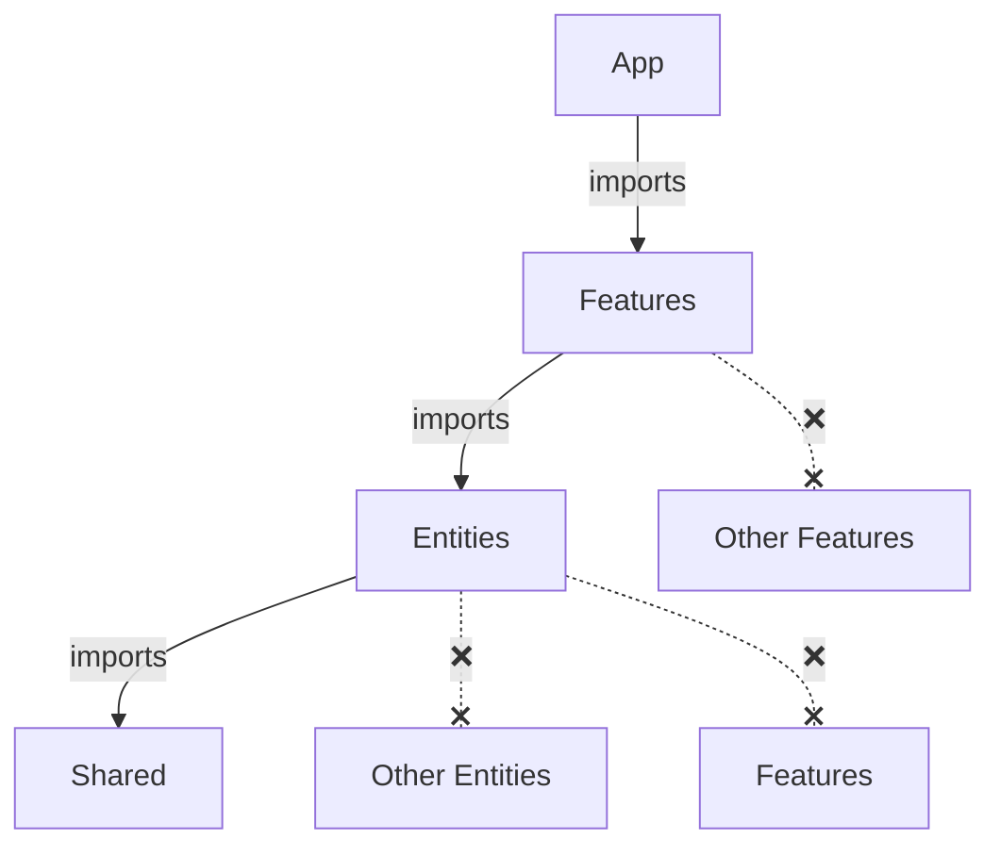

# 🤖 FAA — Rules for AI/LLM Agents

> This document describes how an AI agent should write, organize, and refactor code in a project using Feature-Action Architecture (FAA).

If you're an AI working with an FAA codebase — **read this first**.

> [!NOTE]
> This document is **language-agnostic**. For concrete code examples in your stack, see [Language Examples](#-language-examples).

---

## 📖 Table of Contents

- [Architecture Overview](#️-architecture-overview)
- [Layer Rules](#-layer-rules)
- [Creating a New Feature](#-creating-a-new-feature)
- [Creating a New Entity](#-creating-a-new-entity)
- [Patterns & Principles](#-patterns--principles)
- [File Naming](#-file-naming)
- [Dependency Injection](#-dependency-injection)
- [Where to Put Code — Decision Tree](#️-where-to-put-code--decision-tree)
- [Dependency Rules](#-dependency-rules)
- [Anti-Patterns — What NOT to Do](#-anti-patterns--what-not-to-do)
- [Refactoring Guide](#-refactoring-guide)
- [Checklist](#-checklist)
- [Language Examples](#-language-examples)

---

## 🏗️ Architecture Overview

FAA has **4 layers**, strict top-to-bottom dependency flow:

```
src/
├── app/          → Assembly: DI container, router, server init
├── features/     → Business use cases (actions, handlers, feature-specific queries)
├── entities/     → Domain data (models, CRUD, reusable domain logic)
└── shared/       → Infrastructure & utilities (logger, DB drivers, pure helpers)
```



> [!IMPORTANT]
> **NEVER** import/reference upward or horizontally between same-level modules. This is the #1 rule.

---

## 📏 Layer Rules

### App Layer (`app/`)

| Aspect | Rule |
|---|---|
| **Purpose** | Wire everything together. Create DI container, register routes, start server. |
| **Can import from** | Features, Entities, Shared |
| **Contains** | DI wiring, route registration, server init, middleware wiring |
| **Should NOT contain** | Business logic, DB queries, domain types |

### Features Layer (`features/`)

| Aspect | Rule |
|---|---|
| **Purpose** | Implement business use cases. Each feature = one slice of functionality. |
| **Can import from** | Entities, Shared |
| **CANNOT import from** | Other Features, App |
| **Contains** | Actions (business logic), HTTP handlers (`api/`), feature-specific queries (`db/`), local helpers (`lib/`), types/DTOs |

> [!IMPORTANT]
> Features represent **user-facing business use cases only**. Internal mechanisms (cron jobs, queue workers, background processors) are not features — they live in `shared/infra/` and are triggered from `app/`.

### Entities Layer (`entities/`)

| Aspect | Rule |
|---|---|
| **Purpose** | Own domain data. Provide CRUD and reusable domain logic. |
| **Can import from** | Shared only |
| **CANNOT import from** | Other Entities, Features, App |
| **Contains** | DB model/schema, DAL (CRUD), domain logic (`lib/`), cache, types |

### Shared Layer (`shared/`)

| Aspect | Rule |
|---|---|
| **Purpose** | Provide infrastructure and pure utilities. |
| **Can import from** | Nothing above (only external packages) |
| **Contains** | `api/` (HTTP primitives, reusable middleware), `lib/` (pure functions), `infra/` (drivers, config, logger) |
| **Should NOT contain** | Business logic, domain types |

---

## 🆕 Creating a New Feature

When you need to add a new feature (business use case), follow these steps:

### Step 1: Create the directory structure

```
features/{feature-name}/
├── api/
│   └── handler          # HTTP transport layer (thin)
├── {verb}.action         # Business logic (THE action)
├── types                 # Request/response types, DTOs
└── [public API boundary] # index.ts in TS/JS; access modifiers in Java/C#/Go
```

Add `db/` (feature-specific queries) and `lib/` (local helpers) only if needed.

### Step 2: Write the Action

The action is a function/class that:

1. **Receives dependencies** via constructor/factory parameters (entity DALs, config, services)
2. **Accepts input** (validated request data)
3. **Orchestrates** — fetches data from entities, applies business rules, performs operations
4. **Returns result** — a domain object or DTO

> [!TIP]
> One action = one use case. If an action does auth + profile + notifications, split it.

### Step 3: Write the Handler

The handler is **thin**. It does exactly three things:

1. **Parse** — extract and validate input from the HTTP request
2. **Delegate** — call the action with the parsed input
3. **Respond** — format the action result into an HTTP response

No business logic. No direct DB access. No domain decisions.

### Step 4: Control the public API boundary

- **TS/JS:** Create `index.ts` that re-exports only the action factory and handler factory. Keep it lean.
- **Java/Kotlin:** Use `package-private` (default) for internal classes, `public` only for what other layers need.
- **C#:** Use `internal` for feature internals, `public` only for the action/handler.
- **Go:** Use unexported names (lowercase) for internal functions.

### Step 5: Register in App

Add the new action and handler to your DI container / wiring in the App layer. The registration order should mirror the layer hierarchy: Shared → Entities → Features → Handlers.

> [!NOTE]
> For complete code examples of all steps, see [Language Examples](#-language-examples).

---

## 🆕 Creating a New Entity

When you need a new domain data model:

### Step 1: Create the directory structure

```
entities/{entity-name}/
├── model              # DB schema / entity class
├── dal                # Data Access Layer (generic CRUD)
└── types              # Domain types
```

Add `lib/` (reusable domain logic) and `cache` only if needed.

### Step 2: Define the Model

The DB schema/entity definition. Only schema — no logic.

### Step 3: Create the DAL

The DAL contains **only generic CRUD**: `findById`, `findMany`, `create`, `update`, `delete`.

Rules:
- No business logic
- No complex aggregations
- No side effects (no emails, no events)
- Just thin wrappers around DB operations

### Step 4: Add domain logic if needed

If the entity has reusable logic needed by 2+ features, create `lib/`:

| File | Contents |
|---|---|
| `lib/queries` | Complex read operations (`getOrCreate`, `findWithRelations`) |
| `lib/commands` | Complex write operations (`deactivate`, `archive`) |
| `lib/helpers` | Pure domain functions (`normalize`, `validate`, `calculate`) |

---

## 📝 Patterns & Principles

### Action = Orchestrator

An action is the **only place** where business logic lives. It:

- Calls entity DALs to fetch/persist data
- Applies domain rules and validations
- Coordinates side effects (email, cache, events)
- Returns a result

An action does NOT:
- Parse HTTP requests (that's the handler's job)
- Access the DB directly (that's the DAL's job)
- Import from other features (that's forbidden)

### Handler = Thin Transport Layer

A handler translates between HTTP and your domain:

```
Request → [parse] → Action(input) → [format] → Response
```

If your handler has `if` statements about domain logic, or calls the DB directly — it's too fat. Move that logic to the action.

### DAL = Pure CRUD

The DAL is a thin data access wrapper. Nothing more.

### DAL vs Lib — Borderline Cases

| Method | Where? | Why |
|---|---|---|
| `findAllActive()` | DAL | Simple filter (e.g. `WHERE active = true`). Still CRUD. |
| `findWithStats()` | `lib/queries` | Aggregation / join — beyond a basic query. |
| `deactivateExpired()` | `lib/commands` | Contains domain rule (what counts as "expired"). |

> Rule of thumb: a simple query with a trivial filter → DAL. Anything with domain logic or complex joins → `lib/`.

### Feature or Entity?

- **Will this logic be used by 2+ features?** → Entity (`entities/{name}/lib/`)
- **Only one feature needs it?** → Keep it in that feature (`features/{name}/db/` or `features/{name}/lib/`)

---

## 📁 File Naming

### Language-agnostic conventions

| Element | Naming pattern | Example |
|---|---|---|
| Action file | `{verb}.action` or `{Verb}Action` | `login.action.ts`, `CreateOrderAction.kt` |
| Handler file | `handler` inside `api/` | `features/auth/api/handler.ts`, `OrderController.kt` |
| Entity model | `model` or entity name | `model.ts`, `User.cs`, `model.go` |
| Entity DAL | `dal` | `dal.ts`, `UserDal.kt`, `dal.go` |
| Feature DB queries | `pipelines`, `queries` | `features/leaderboard/db/pipelines.ts` |
| Types / DTOs | `types` or `dto/` | `types.ts`, `dto/OrderDto.kt` |

> [!TIP]
> Action files use the **verb** as the name: `login`, `generate`, `get-profile`, `create-order`.
> Not nouns: ~~`auth.action`~~, ~~`user.action`~~.

---

## 🔌 Dependency Injection

### Principle

Every action, handler, and DAL declares its dependencies explicitly through constructor/factory parameters. No hidden globals, no magic imports of singletons.

### Container wiring order

The DI container must register dependencies in layer order:

```
1. Shared    (config, DB connection, logger)
2. Entities  (DALs — depend on Shared)
3. Features  (Actions — depend on Entities + Shared)
4. Handlers  (depend on Actions)
```

> [!IMPORTANT]
> This is not a coincidence — the registration order mirrors the dependency flow.

### DI per stack

| Stack | DI mechanism |
|---|---|
| TypeScript | `typed-inject`, `tsyringe`, or manual factories |
| Kotlin / Spring | Spring DI (`@Service`, `@Repository`, constructor injection) |
| Go | `uber-fx`, `wire`, or manual wiring |
| Python | `dependency-injector`, or manual container with `@dataclass` |
| C# / ASP.NET | Built-in `IServiceCollection` (`AddScoped`, `AddTransient`) |

> [!NOTE]
> For concrete DI wiring examples, see [Language Examples](#-language-examples).

---

## 🗺️ Where to Put Code — Decision Tree

Follow this when deciding where new code belongs:

```
Is it a pure utility (datetime, math, encoding)?
  → shared/lib/

Is it infrastructure (DB driver, logger, config)?
  → shared/infra/

Is it an HTTP primitive (error class, response helper)?
  → shared/api/

Is it a reusable middleware (auth guard, rate limiter, request validation)?
  → shared/api/ (the middleware itself)
  → app/ (wiring it to routes)

Is it a DB schema/model?
  → entities/{name}/model

Is it generic CRUD for one entity?
  → entities/{name}/dal

Is it reusable domain logic for one entity (used or will be used by 2+ features)?
  → entities/{name}/lib/

Is it a complex query needed by only one feature?
  → features/{name}/db/

Is it business orchestration (calling multiple entities)?
  → features/{name}/{verb}.action

Is it an HTTP handler?
  → features/{name}/api/handler

Is it a request/response type for one feature?
  → features/{name}/types
```

---

## 🚫 Dependency Rules

### ✅ Allowed

| Direction | Example |
|---|---|
| Feature → Entity | Action uses the User DAL |
| Feature → Shared | Action uses a datetime utility |
| Entity → Shared | Model uses a shared type |
| App → Feature | Container wires an action |
| App → Entity | Container wires a DAL |
| App → Shared | Container reads config |

### ❌ Forbidden

| Direction | Why | Fix |
|---|---|---|
| Feature → Feature | Horizontal dependency (includes types, errors, everything) | Move shared logic/types to Entity or Shared. Example: email needed by 2+ features → `shared/lib/mailer` |
| Entity → Entity | Entities are isolated | Do the join in the Feature action |
| Entity → Feature | Upward dependency | Never |
| Shared → Entity | Upward dependency | Never |
| Shared → Feature | Upward dependency | Never |

> [!CAUTION]
> When you see a horizontal or upward dependency — **STOP**. Refactor before proceeding.
> Move shared logic down to the appropriate layer.

---

## 🚫 Anti-Patterns — What NOT to Do

### ❌ God Action

An action that does auth + profile + notifications + analytics in 200 lines.

**Fix:** Split into separate actions in separate features. One action = one use case.

---

### ❌ Business Logic in DAL

A DAL method that hashes passwords, sends emails, or calculates levels.

**Fix:** DAL only does CRUD. Hashing, emailing, and calculations happen in the action.

---

### ❌ Fat Handler

A handler that queries the DB directly, checks business rules, and formats output.

**Fix:** Handler calls action. Action does the work. Handler only parses, delegates, responds.

---

### ❌ Shared Code Between Features

Feature A imports a helper/type/error from Feature B.

**Fix:** Move the shared code down to `entities/{name}/lib/` or `shared/lib/`.

---

### ❌ Global barrel re-exports (TS/JS-specific)

A single `entities/index.ts` or `features/index.ts` that re-exports everything.

**Fix:** Import from specific modules: `entities/user`, `features/auth`. In Java / C# / Go, this is enforced naturally by access modifiers.

---

## 🔄 Refactoring Guide

When refactoring existing code to FAA:

### Moving a Service method → Action

1. Identify what the method does (one use case = one action)
2. Create `features/{name}/{verb}.action`
3. Extract dependencies into constructor/factory parameters
4. Move feature-specific queries to `features/{name}/db/`
5. Move reusable entity logic to `entities/{name}/lib/`
6. Create a thin handler in `features/{name}/api/`
7. Wire in the App layer (DI container + routes)

### Moving a Repository → Entity DAL

1. Identify generic CRUD operations → `entities/{name}/dal`
2. Identify reusable domain logic → `entities/{name}/lib/`
3. Identify feature-specific queries → `features/{name}/db/`
4. Delete the repository file

### Splitting a God Service

1. List all methods in the service
2. Group by business use case (each group = one feature)
3. Create a feature directory for each group
4. Move each method into its own action
5. Extract shared entity logic into `entities/{name}/lib/`

---

## ✅ Checklist

Before considering a task done, verify:

- [ ] No upward dependencies (entity → feature, shared → entity)
- [ ] No horizontal dependencies (feature → feature, entity → entity)
- [ ] Every feature has a public API boundary (barrel file in TS/JS; access modifiers in Java/C#/Go)
- [ ] Actions receive dependencies explicitly (no hidden globals)
- [ ] Handlers are thin (parse → delegate → respond)
- [ ] DAL contains only generic CRUD (no business logic)
- [ ] Feature-specific queries live in `features/{name}/db/`
- [ ] Reusable domain logic lives in `entities/{name}/lib/`
- [ ] Types/DTOs are in the correct layer
- [ ] New feature/entity is registered in the DI container
- [ ] Routes are registered in the App layer

---

## 🧪 Testing

FAA makes unit testing straightforward because **all dependencies are explicit**. To test an action, pass mock implementations of its dependencies.

### Example (TypeScript)

```typescript
it("register creates a user and returns their data", async () => {
  const mockDal = {
    findByEmail: vi.fn().mockResolvedValue(null),
    create: vi.fn().mockResolvedValue({ id: 1, email: "a@b.com", name: "Alice" }),
  };

  const register = createRegisterAction({ userDal: mockDal });
  const result = await register({ email: "a@b.com", password: "pass", name: "Alice" });

  expect(result).toEqual({ id: 1, email: "a@b.com", name: "Alice" });
  expect(mockDal.create).toHaveBeenCalledOnce();
});
```

The same principle applies in any language: pass stubs/mocks for the DAL and config, test the action in isolation.

> [!TIP]
> If a test needs many mocked dependencies, the action is probably doing too much. Split it.

---

## 🌍 Language Examples

Full working examples with project structure, DI wiring, and code:

| Stack | Example |
|---|---|
| TypeScript + Bun | [examples/ts-bun.md](./examples/ts-bun.md) |
| Kotlin + Spring Boot | [examples/kotlin-springboot.md](./examples/kotlin-springboot.md) |
| Go + Gin + uber-fx | [examples/golang-gin.md](./examples/golang-gin.md) |
| Python + Django | [examples/python-django.md](./examples/python-django.md) |
| C# + ASP.NET Core | [examples/csharp-asp.md](./examples/csharp-asp.md) |
| Java + Spring Boot | [examples/java-springboot.md](./examples/java-springboot.md) |
| PHP + Laravel | [examples/php-laravel.md](./examples/php-laravel.md) |
| F# + Giraffe | [examples/fsharp-giraffe.md](./examples/fsharp-giraffe.md) |
| Rust + Axum | [examples/rust-axum.md](./examples/rust-axum.md) |
