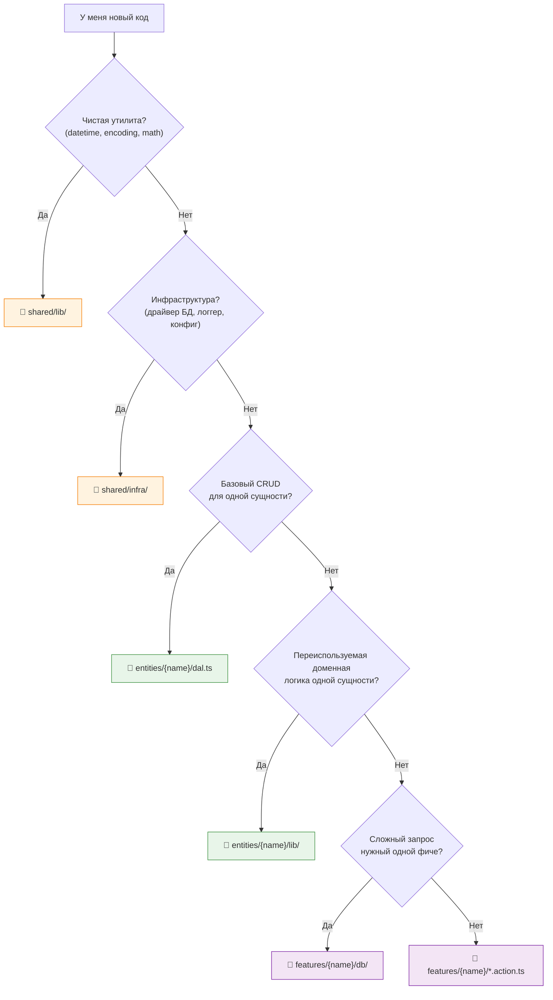

# 📜 Манифест FAA

> «Коротко» о том, "зачем" и "как" устроена Feature-Action Architecture.

[](./MANIFEST.md)

---

## 📖 Содержание

- [Зачем FAA](#-зачем-faa)
- [5 Правил](#-5-правил)
- [Анатомия Feature](#-анатомия-feature)
- [Анатомия Entity](#-анатомия-entity)
- [Куда Класть Код](#️-куда-класть-код)
- [Анти-паттерны](#-анти-паттерны)
- [Когда Нарушать Правила](#-когда-нарушать-правила)

---

## 💡 Зачем FAA

Мы все через это проходили. Открываешь проект и видишь:

```
services/UserService.ts      — 400 строк, тут и авторизация, и профили, и настройки
services/OrderService.ts     — 600 строк, корзина, оплата, доставка
repositories/UserRepository   — половина методов просто зовёт .findOne()
```

Граница между "сервисом" и "репозиторием" размыта. Один разработчик пишет бизнес-логику в сервисе, другой — в репозитории. Третий создаёт "хелпер", потому что не знает, куда положить. Кодовая база превращается в лабиринт.

**FAA даёт чёткие правила.** Не рекомендации — правила. Чтобы каждый разработчик (и каждый AI-агент) знал, куда именно класть код.

---

## ⚡ 5 Правил

### Правило 1: 🍕 Режь, а не слои

**Не** организуй код по технической роли. **Организуй** по бизнес-домену.

```
❌ Плохо                         ✅ Хорошо
controllers/                     features/
  authController.ts                auth/
  userController.ts                  api/handler.ts
services/                            login.action.ts
  authService.ts                   user-profile/
  userService.ts                     api/handler.ts
repositories/                        get-profile.action.ts
  authRepo.ts
  userRepo.ts
```

> Хочешь разобраться в логине? В FAA открываешь `features/auth/` — всё на месте)

### Правило 2: ⚡ Actions, а не Services

Service — это мешок слабо связанных методов. Action — это **одна функция**, которая делает **одну вещь**.

```
❌ UserService.register()       ✅ features/auth/register.action.ts
❌ UserService.getProfile()     ✅ features/user-profile/get-profile.action.ts
❌ UserService.updateSettings() ✅ features/settings/update.action.ts
```

Actions создаются через **фабричные функции**, принимающие зависимости (к примеру через `typed-inject`):

```typescript
export const createRegisterAction = (deps: { userDal, mailer }) =>
  async (data: RegisterInput) => {
    const user = await deps.userDal.create(data);
    await deps.mailer.sendWelcome(user.email);
    return user;
  };
```

<details>
<summary>🔌 <b>подключение через typed-inject (минимально)</b></summary>

```typescript
import { createInjector } from "typed-inject";

const container = createInjector()
  .provideFactory("userDal", createUserDal)
  .provideFactory("mailer", createMailer)
  .provideFactory("registerAction", createRegisterAction);

const register = container.resolve("registerAction");
```

</details>

> [!TIP]
> Action — это оркестратор. Он зовёт Entity DAL, применяет бизнес-правила и возвращает результат. Всё.

### Правило 3: ⬇️ Строго Вниз

```
App → Features → Entities → Shared
```

Каждая стрелка указывает **вниз**. Без исключений[^1].

- Feature **может** импортировать из Entity и Shared
- Entity **может** импортировать из Shared
- Feature **не может** импортировать другую Feature
- Entity **не может** импортировать другую Entity
- Из App не импортирует никто (кроме точки входа)

[^1]: Ну, есть прагматичные исключения. Смотри [Когда Нарушать Правила](#-когда-нарушать-правила).

### Правило 4: 📍 Локализация Данных

Не сваливай все запросы в глобальную папку `repositories/`. Клади их **туда, где используются**.

| Тип запроса | Где живёт | Пример |
|---|---|---|
| Базовый CRUD | `entities/{name}/dal.ts` | `findById`, `create`, `update` |
| Переиспользуемая доменная логика | `entities/{name}/lib/` | `getOrCreate`, `updatePrivacy` |
| Фича-специфичные запросы | `features/{name}/db/` | Сложные агрегации, джойны, отчёты |

> [!NOTE]
> Вот ключевой инсайт: aggregation pipeline для лидерборда не имеет отношения к `UserEntity`. Он живёт в `features/leaderboard/db/pipelines.ts`.

### Правило 5: 🔌 Явные Зависимости

Никаких скрытых глобалов. Никаких `import db from '../../../shared/db'` глубоко в сервисе. Зависимости приходят через **фабричную инъекцию** (к примеру через `typed-inject`):

```typescript
// ✅ Зависимости явные и видимые
export const createLoginAction = (deps: { userDal, config }) =>
  async (data) => { /* ... */ };

// ❌ Скрытая зависимость от глобального синглтона
import { db } from "../../../shared/db";
export const login = async (data) => {
  const user = await db.users.findOne(/*...*/);
};
```

> [!TIP]
> Явные зависимости = легко тестировать (просто передай моки), легко понимать (читай тайп-сигнатуру), легко рефакторить (найти все использования).

---

## 🔬 Анатомия Feature

Каждая фича следует одной структуре:

```
features/{feature-name}/
├── api/
│   └── handler.ts         # HTTP транспорт
├── db/
│   ├── pipelines.ts       # Сложные запросы к БД (агрегации, джойны)
│   └── cache.ts           # Кэширование (если нужно)
├── lib/
│   └── helpers.ts         # Локальные утилиты фичи
├── {name}.action.ts       # 🌟 ОСНОВНАЯ бизнес-логика
├── types.ts               # Типы и интерфейсы
└── index.ts               # Публичное API (только это можно импортировать!)
```

> [!IMPORTANT]
> `index.ts` — **единственная точка входа**. Всё остальное — internal. Внешний код импортирует из `features/auth/index.ts`, никогда напрямую из `features/auth/lib/helpers.ts`.

### Что делает каждый файл

| Файл | Ответственность | Толщина |
|---|---|---|
| `api/handler.ts` | Парсит запрос → зовёт action → форматирует ответ | Тонкий |
| `*.action.ts` | Оркестрирует вызовы entity, применяет бизнес-правила | **Основная логика** |
| `db/pipelines.ts` | Фича-специфичные запросы (агрегации, сложные джойны) | Данные |
| `lib/` | Вычисления, трансформации, валидация | Хелперы |
| `types.ts` | Типы запросов/ответов, внутренние интерфейсы | Типы |
| `index.ts` | Реэкспорт публичного API | Баррель |

---

## 📦 Анатомия Entity

Entities владеют доменными данными и предоставляют **переиспользуемые** операции:

```
entities/{entity-name}/
├── model.ts              # Схема БД
├── dal.ts                # Data Access Layer (CRUD)
├── cache.ts              # Операции кэширования (опционально)
├── lib/
│   ├── queries.ts        # Сложные операции чтения
│   ├── commands.ts       # Сложные операции записи
│   └── helpers.ts        # Чистые доменные функции
└── types.ts              # TypeScript типы, в других языках это могут быть так же декларации типов
```

### DAL vs Lib

| `dal.ts` | `lib/` |
|---|---|
| Только базовый CRUD | Богатая доменная логика |
| `findById`, `create`, `update`, `delete` | `getOrCreate`, `findWithRelations` |
| Ноль бизнес-логики | Может содержать бизнес-правила |
| Есть у каждой entity | Только если нужно |

> [!TIP]
> Если сомневаешься "это CRUD или бизнес-логика?" — если это больше чем `Model.findOne()`, скорее всего место в `lib/`.

---

## 🗺️ Куда Класть Код

Когда не уверен, следуй этому:



Быстрая шпаргалка:

| Мне нужно... | Кладу в... |
|---|---|
| Найти юзера по ID | `entities/user/dal.ts` |
| Найти-или-создать юзера | `entities/user/lib/queries.ts` |
| Нормализовать username | `entities/user/lib/helpers.ts` |
| Получить топ-10 для гонки | `features/leaderboard/race/db/pipelines.ts` |
| Сгенерить размер, закэшировать, проверить ачивки | `features/cock-size/generate.action.ts` |
| Форматировать дату по Москве | `shared/lib/datetime/` |
| Подключиться к MongoDB | `shared/infra/persistence/` |
| Обработать `POST /api/auth/login` | `features/auth/api/handler.ts` |

---

## 🚫 Анти-паттерны

### ❌ God Action

```typescript
// ПЛОХО: один action делает всё
export const createEverythingAction = (deps) =>
  async (userId) => {
    // 50 строк логики авторизации
    // 50 строк логики профиля
    // 50 строк логики уведомлений
  };
```

**Фикс:** разбей на `loginAction`, `getProfileAction`, `notifyAction`.

### ❌ Feature импортирует Feature

```typescript
// ПЛОХО: горизонтальная зависимость
import { getProfile } from "../user-profile";

export const createDashboardAction = () =>
  async () => {
    const profile = await getProfile(); // ❌
  };
```

**Фикс:** вынеси общую логику в Entity, пусть обе фичи импортируют оттуда.

### ❌ Бизнес-логика в DAL

```typescript
// ПЛОХО: dal.ts не должен считать уровни
export const createUserDal = () => ({
  levelUp: async (userId: string) => {
    const user = await UserModel.findById(userId);
    const newLevel = Math.floor(user.exp / 100); // ❌ бизнес-логика
    return UserModel.updateOne({ _id: userId }, { level: newLevel });
  },
});
```

**Фикс:** расчёт уровня — в `entities/user/lib/` или в action фичи.

### ❌ Запросы не на своём месте

```typescript
// ПЛОХО: глобальный пайплайн, который нужен только лидерборду
// shared/queries/top-players-pipeline.ts  ← ❌
```

**Фикс:** `features/leaderboard/db/pipelines.ts` — держи там, где используется.

---

## 🤝 Когда Нарушать Правила

FAA — практичная архитектура, а не догма. Допустимые компромиссы:

| Ситуация | Компромисс | Условие |
|---|---|---|
| Двум фичам нужен один хелпер | Оставь в одной фиче, импортируй из другой | **Временно.** Запланируй вынос в Entity/Shared. |
| Формула используется в 3+ фичах | Положи в `shared/lib/` | Даже если выглядит "бизнесово" |
| Маленькая фича без `db/` | Пропусти папку | Не каждой фиче нужны запросы к БД |
| Entity нужны данные другой entity | Сделай джоин в Action фичи | Entity остаётся изолированной, Feature оркестрирует |

> [!CAUTION]
> Нарушать правило — ок, **если ты это признаёшь** и есть план поправить потом. Тихие нарушения копятся в спагетти)
