# 📜 FAA Manifesto

> The «short» version of "why" and "how" behind Feature-Action Architecture.

[](./MANIFEST.RU.md)

---

## 📖 Table of Contents

- [Why FAA Exists](#-why-faa-exists)
- [The 5 Rules](#-the-5-rules)
- [Feature Anatomy](#-feature-anatomy)
- [Entity Anatomy](#-entity-anatomy)
- [Where to Put Code](#-where-to-put-code)
- [Anti-Patterns](#-anti-patterns)
- [When to Break the Rules](#-when-to-break-the-rules)
- [Language Examples](#-language-examples)

---

## 💡 Why FAA Exists

We've all been there. You open a project and see:

```
services/UserService.ts      — 400 lines, handles auth, profiles, settings
services/OrderService.ts     — 600 lines, handles cart, payment, shipping
repositories/UserRepository   — half the methods just call .findOne()
```

The boundaries between "service" and "repository" are blurry. One dev puts business logic in a service, another puts it in a repository. A third creates a "helper" because they're not sure where it belongs. The codebase becomes a maze.

**FAA gives you clear rules.** Not suggestions — rules. So that every developer (and every AI agent) knows exactly where code goes.

---

## ⚡ The 5 Rules

### Rule 0: 🎯 Features Are User-Facing

A feature implements a **business use case that a user can trigger**. Internal mechanisms — cron jobs, queue workers, background processors — are not features. They live in `shared/infra/` and are wired from `app/`.

### Rule 1: 🍕 Slice, Don't Layer

**Don't** organize by technical role. **Do** organize by business domain.

```
❌ Bad                          ✅ Good
controllers/                    features/
  authController.ts               auth/
  userController.ts                 api/handler.ts
services/                           login.action.ts
  authService.ts                  user-profile/
  userService.ts                    api/handler.ts
repositories/                       get-profile.action.ts
  authRepo.ts
  userRepo.ts
```

> Want to understand the login flow? In FAA, open `features/auth/` — everything is right there.

### Rule 2: ⚡ Actions, Not Services

A Service is a bag of loosely related methods. An Action is a **single function** that does **one thing**.

```
❌ UserService.register()       ✅ features/auth/register.action.ts
❌ UserService.getProfile()     ✅ features/user-profile/get-profile.action.ts
❌ UserService.updateSettings() ✅ features/settings/update.action.ts
```

Actions are created through **factory functions** that accept dependencies (for example, via `typed-inject`):

```typescript
export const createRegisterAction = (deps: { userDal, mailer }) =>
  async (data: RegisterInput) => {
    const user = await deps.userDal.create(data);
    await deps.mailer.sendWelcome(user.email);
    return user;
  };
```

<details>
<summary>🔌 <b>typed-inject wiring (minimal)</b></summary>

```typescript
import { createInjector } from "typed-inject";

const container = createInjector()
  .provideFactory("userDal", createUserDal)
  .provideFactory("mailer", createMailer)
  .provideFactory("registerAction", createRegisterAction);

const register = container.resolve("registerAction");
```

</details>

> [!TIP]
> An Action is an orchestrator. It calls Entity DALs, applies business rules, and returns a result. That's it.

### Rule 3: ⬇️ Strict Downward Flow

```
App → Features → Entities → Shared
```

Every arrow points **down**. No exceptions[^1].

- Feature **can** import from Entity and Shared
- Entity **can** import from Shared
- Feature **cannot** import another Feature
- Entity **cannot** import another Entity
- Nobody imports from App (except the entry point)

[^1]: Well, there are pragmatic exceptions. See [When to Break the Rules](#-when-to-break-the-rules).

### Rule 4: 📍 Localize Data Access

Don't dump all queries into a global `repositories/` folder. Put them **where they're used**.

| Query type | Where it lives | Example |
|---|---|---|
| Generic CRUD | `entities/{name}/dal.ts` | `findById`, `create`, `update` |
| Reusable domain logic | `entities/{name}/lib/` | `getOrCreate`, `updatePrivacy` |
| Feature-specific queries | `features/{name}/db/` | Complex aggregations, joins, reports |

> [!NOTE]
> This is the key insight: a leaderboard aggregation pipeline has nothing to do with `UserEntity`. It belongs in `features/leaderboard/db/pipelines.ts`.

### Rule 5: 🔌 Explicit Dependencies

No hidden globals. No `import db from '../../../shared/db'` deep in a service. Dependencies come through **factory injection** (for example, via `typed-inject`):

```typescript
// ✅ Dependencies are explicit and visible
export const createLoginAction = (deps: { userDal, config }) =>
  async (data) => { /* ... */ };

// ❌ Hidden dependency on global singleton
import { db } from "../../../shared/db";
export const login = async (data) => {
  const user = await db.users.findOne(/*...*/);
};
```

> [!TIP]
> Explicit deps = easy to test (just pass mocks), easy to reason about (read the type signature), easy to refactor (find all usages).

---

## 🔬 Feature Anatomy

Every feature follows the same structure:

```
features/{feature-name}/
├── api/
│   └── handler.ts         # HTTP transport layer
├── db/
│   ├── pipelines.ts       # Complex DB queries (aggregations, joins)
│   └── cache.ts           # Caching logic (if needed)
├── lib/
│   └── helpers.ts         # Feature-local utilities
├── {name}.action.ts       # 🌟 THE business logic
├── types.ts               # Types and interfaces
└── index.ts               # Public API (only this is importable!)
```

> [!IMPORTANT]
> `index.ts` is the **only entry point**. Everything else is internal to the feature. External code imports from `features/auth/index.ts`, never from `features/auth/lib/helpers.ts` directly.
>
> Keep `index.ts` lean — only re-export what the App layer actually needs (usually the action factory and the handler factory). Don't dump every internal helper into the barrel.
>
> **Other languages:** In Java / C# / Go the same idea is enforced by access modifiers (`package-private`, `internal`, unexported). No barrel file needed — just don't make internal classes/methods public.

### What each file does

| File | Responsibility | Thickness |
|---|---|---|
| `api/handler.ts` | Parse request → call action → format response | Thin |
| `*.action.ts` | Orchestrate entity calls, apply business rules | **Main logic** |
| `db/pipelines.ts` | Feature-specific queries (aggregation, complex joins) | Data |
| `lib/` | Calculations, transformations, validation | Helper |
| `types.ts` | Request/response types, internal interfaces | Types |
| `index.ts` | Re-export public API | Barrel |

---

## 📦 Entity Anatomy

Entities own domain data and provide **reusable** operations:

```
entities/{entity-name}/
├── model.ts              # DB schema definition
├── dal.ts                # Data Access Layer (CRUD)
├── cache.ts              # Cache operations (optional)
├── lib/
│   ├── queries.ts        # Complex read operations
│   ├── commands.ts       # Complex write operations
│   └── helpers.ts        # Pure domain functions
└── types.ts              # TypeScript types
```

### DAL vs Lib

| `dal.ts` | `lib/` |
|---|---|
| Basic CRUD only | Rich domain logic |
| `findById`, `create`, `update`, `delete` | `getOrCreate`, `findWithRelations` |
| Zero business logic | Can contain business rules |
| Every entity has it | Only if needed |

Borderline cases:

| Method | Where? | Why |
|---|---|---|
| `findAllActive()` | `dal.ts` | It's a simple filter — `find({ active: true })`. Still CRUD. |
| `findWithStats()` | `lib/queries.ts` | Aggregation / join — goes beyond a basic `.find()` call. |
| `deactivateExpired()` | `lib/commands.ts` | Contains domain rule (what counts as "expired"). |

> [!TIP]
> If you're debating "is this CRUD or business logic?" — if it's more than a single `Model.findOne()` / `find()` with a trivial filter, it probably belongs in `lib/`.

---

## 🗺️ Where to Put Code

When in doubt, follow this:

```mermaid
graph TD
    START["I have new code"] --> Q1{"Is it a pure utility?<br/>(datetime, encoding, math)"}
    Q1 -->|Yes| SHARED["📁 shared/lib/"]
    Q1 -->|No| Q2{"Is it infrastructure?<br/>(DB driver, logger, config)"}
    Q2 -->|Yes| INFRA["📁 shared/infra/"]
    Q2 -->|No| Q3{"Is it generic CRUD<br/>for a single entity?"}
    Q3 -->|Yes| DAL["📁 entities/{name}/dal.ts"]
    Q3 -->|No| Q4{"Is it reusable domain logic<br/>for a single entity?"}
    Q4 -->|Yes| LIB["📁 entities/{name}/lib/"]
    Q4 -->|No| Q5{"Is it a complex query<br/>needed by one feature?"}
    Q5 -->|Yes| FDB["📁 features/{name}/db/"]
    Q5 -->|No| ACTION["📁 features/{name}/*.action.ts"]

    style SHARED fill:#fff3e0,stroke:#f57c00
    style INFRA fill:#fff3e0,stroke:#f57c00
    style DAL fill:#e8f5e9,stroke:#388e3c
    style LIB fill:#e8f5e9,stroke:#388e3c
    style FDB fill:#f3e5f5,stroke:#7b1fa2
    style ACTION fill:#f3e5f5,stroke:#7b1fa2
```



### Feature or Entity?

> [!TIP]
> **Will this logic be used by 2+ features?** → Entity (`entities/{name}/lib/`).
> **Only one feature needs it?** → Keep it in that feature (`features/{name}/db/` or `features/{name}/lib/`).

Quick cheat sheet:

| I need to... | Put it in... |
|---|---|
| Find a user by ID | `entities/user/dal.ts` |
| Find-or-create a user | `entities/user/lib/queries.ts` |
| Normalize a username | `entities/user/lib/helpers.ts` |
| Get top-10 for a race | `features/leaderboard/race/db/pipelines.ts` |
| Generate a daily size, cache it, check achievements | `features/cock-size/generate.action.ts` |
| Format a date in Moscow time | `shared/lib/datetime/` |
| Connect to MongoDB | `shared/infra/persistence/` |
| Handle `POST /api/auth/login` | `features/auth/api/handler.ts` |

---

## 🚫 Anti-Patterns

### ❌ God Action

```typescript
// BAD: one action doing everything
export const createEverythingAction = (deps) =>
  async (userId) => {
    // 50 lines of auth logic
    // 50 lines of profile logic
    // 50 lines of notification logic
  };
```

**Fix:** split into `loginAction`, `getProfileAction`, `notifyAction`.

### ❌ Feature importing Feature

```typescript
// BAD: horizontal dependency
import { getProfile } from "../user-profile";

export const createDashboardAction = () =>
  async () => {
    const profile = await getProfile(); // ❌
  };
```

**Fix:** move shared logic to an Entity or `shared/lib/`. Example: if `auth` and `notifications` both need to send email — `shared/lib/mailer`, not one feature importing the other.

### ❌ Business logic in DAL

```typescript
// BAD: dal.ts shouldn't calculate levels
export const createUserDal = () => ({
  levelUp: async (userId: string) => {
    const user = await UserModel.findById(userId);
    const newLevel = Math.floor(user.exp / 100); // ❌ business logic
    return UserModel.updateOne({ _id: userId }, { level: newLevel });
  },
});
```

**Fix:** put level calculation in `entities/user/lib/` or in the feature action.

### ❌ Queries in the wrong place

```typescript
// BAD: a global pipeline that only leaderboard uses
// shared/queries/top-players-pipeline.ts  ← ❌
```

**Fix:** `features/leaderboard/db/pipelines.ts` — keep it where it's used.

---

## 🤝 When to Break the Rules

FAA is practical, not dogmatic. Here are acceptable compromises:

| Situation | Compromise | Condition |
|---|---|---|
| Two features need the same helper | Keep it in one feature, import from another | **Temporary.** Plan to extract to Entity/Shared. |
| A formula is used in 3+ features | Put it in `shared/lib/` | Even if it looks "business-y" |
| A tiny feature has no `db/` | Skip the folder | Not every feature needs DB queries |
| Entity needs data from another entity | Do the join in the Feature action | Entity stays isolated, Feature orchestrates |

> [!CAUTION]
> Breaking a rule is fine **if you acknowledge it** and have a plan to fix it later. Silent violations compound into spaghetti.

---

## 🌍 Language Examples

See FAA in action across different stacks:

| Stack | Example |
|---|---|
| TypeScript + Bun | [examples/ts-bun.md](./examples/ts-bun.md) |
| Kotlin + Spring Boot | [examples/kotlin-springboot.md](./examples/kotlin-springboot.md) |
| Go + Gin + uber-fx | [examples/golang-gin.md](./examples/golang-gin.md) |
| Python + Django | [examples/python-django.md](./examples/python-django.md) |
| C# + ASP.NET Core | [examples/csharp-asp.md](./examples/csharp-asp.md) |
| Java + Spring Boot | [examples/java-springboot.md](./examples/java-springboot.md) |
| PHP + Laravel | [examples/php-laravel.md](./examples/php-laravel.md) |
| F# + Giraffe | [examples/fsharp-giraffe.md](./examples/fsharp-giraffe.md) |
| Rust + Axum | [examples/rust-axum.md](./examples/rust-axum.md) |
