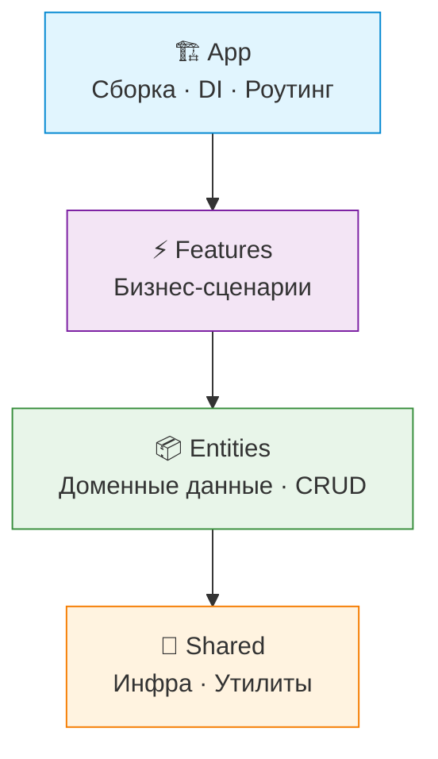
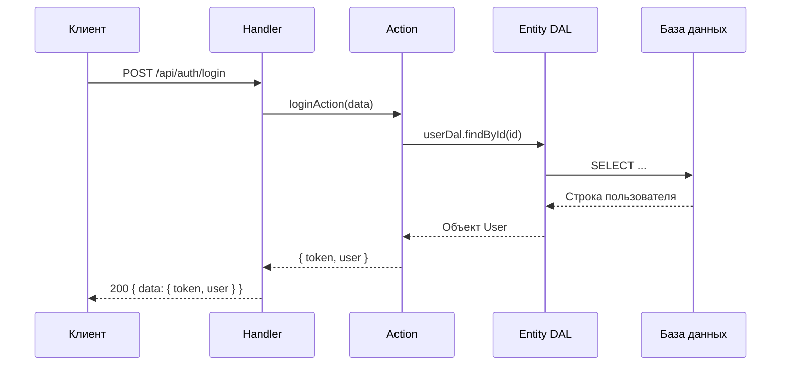
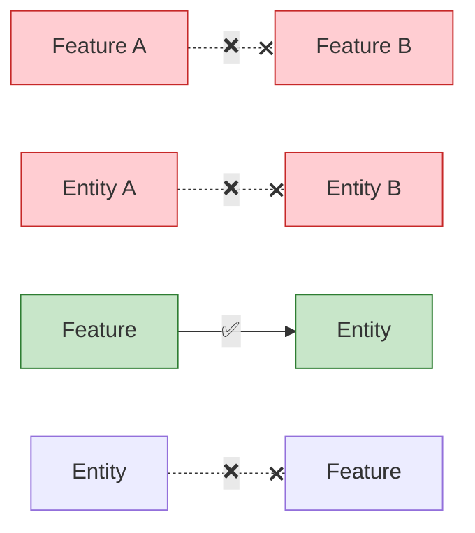

# 🍕 Feature-Action Architecture (FAA)

> **Режь бэкенд на фичи. Заменяй сервисы на экшены. Держи в чистоте.**

FAA — это адаптация [Feature-Sliced Design](https://feature-sliced.design/) для бэкенда. Код организован по **бизнес-доменам** (вертикальные слайсы), а бизнес-логика живёт в изолированных **action-функциях** вместо монолитных сервис-классов.

Архитектура не привязана к языку или парадигме. Хочешь ФП — пожалуйста, хочешь ООП — тоже ок.
Все примеры тут на TypeScript + функциональный стиль, но идеи универсальны)

[](./README.md)

---

## 📖 Содержание

- [🍕 Feature-Action Architecture (FAA)](#-feature-action-architecture-faa)
  - [📖 Содержание](#-содержание)
  - [😩 Проблема](#-проблема)
  - [🤔 Что такое FAA?](#-что-такое-faa)
  - [🎯 Базовые Принципы](#-базовые-принципы)
  - [🏗️ Иерархия Слоёв](#️-иерархия-слоёв)
  - [📁 Структура Проекта](#-структура-проекта)
  - [⚡ Быстрый Пример](#-быстрый-пример)
    - [Флоу данных](#флоу-данных)
  - [🚦 Правила Зависимостей](#-правила-зависимостей)
  - [🔗 Подключить к своему проекту](#-подключить-к-своему-проекту)
    - [1) Сослаться на репозиторий](#1-сослаться-на-репозиторий)
    - [2) Добавить FAA как git submodule (рекомендуется)](#2-добавить-faa-как-git-submodule-рекомендуется)
  - [📚 Читай Дальше](#-читай-дальше)
    - [Примеры по языкам](#примеры-по-языкам)

---

## 😩 Проблема

Классическая бэкенд-архитектура даёт тебе горизонтальные слои:

```
src/
├── controllers/    # Тонкие обёртки, зовущие сервисы
├── services/       # ГОД ОБДЖЕКТЫ, которые делают ВСЁ
├── repositories/   # Доступ к данным, часто дублирует логику сервисов
└── models/         # Схемы, далеко от кода, который их использует
```

Когда проект растёт:
- `UserService` превращается в монстра на 500 строк — авторизация, профили, настройки, уведомления...
- Репозитории дублируют логику сервисов или становятся бессмысленными прокладками
- Добавление фичи — это 4+ директории, которые нужно затронуть
- Никто не знает, запрос живёт в сервисе или в репозитории

**Знакомо?)**

---

## 🤔 Что такое FAA?

FAA переворачивает подход:

| Традиционно | FAA |
|---|---|
| Организация по **технической роли** (controllers, services...) | Организация по **бизнес-домену** (auth, leaderboard...) |
| Класс `UserService` с 20 методами | `loginAction`, `getProfileAction` — одна функция, одна задача |
| Репозитории с размытыми границами | Запросы живут там, где используются |
| Неявные зависимости через импорты | Явные зависимости через фабрики + DI |

---

## 🎯 Базовые Принципы

| # | Принцип | Суть |
|---|---|---|
| 1 | 🍕 **Режь, а не слои** | Никаких глобальных `services/`, `controllers/`, `repositories/`. Организация по фичам. |
| 2 | ⚡ **Actions вместо Services** | Никаких классов `UserService`. Пиши `loginAction` — одна функция, одна задача. |
| 3 | ⬇️ **Строго вниз** | `App → Features → Entities → Shared`. Никогда вверх. Никогда вбок. |
| 4 | 📍 **Локализация данных** | Базовый CRUD → Entities. Сложные запросы → Feature, которая их использует. |
| 5 | 🔌 **Явные зависимости** | Фабричные функции + DI. Никаких скрытых глобалов. |

---

## 🏗️ Иерархия Слоёв



| Слой | Что делает | Что содержит |
|---|---|---|
| **🏗️ App** | Собирает всё вместе | Инициализация сервера, DI контейнер, роутер, подключение мидлварей (auth guards, rate limiting и т.д.) |
| **⚡ Features** | Реализует юзкейсы | Actions, HTTP handlers, фича-специфичные запросы |
| **📦 Entities** | Владеет доменными данными | Модели БД, CRUD (DAL), переиспользуемая доменная логика |
| **🔧 Shared** | Даёт инструменты | Логгер, драйверы БД, конфиг, HTTP утилиты, чистые хелперы, переиспользуемые мидлвари |

> [!IMPORTANT]
> Каждый слой может импортировать только из слоёв **ниже** себя. Никогда вверх, никогда вбок.

---

## 📁 Структура Проекта

```
src/
├── app/                          # 🏗️ Сборка
│   ├── container.ts              # DI линковка
│   ├── routes.ts                 # Регистрация роутов из фичей
│   └── server.ts                 # Старт сервера
│
├── features/                     # ⚡ Бизнес кейсы
│   ├── auth/
│   │   ├── api/handler.ts        # HTTP слой
│   │   ├── login.action.ts       # Бизнес-логика (тот самый action)
│   │   ├── lib/                  # Локальная библиотека фичи, к примеру работа с куками.
│   │   ├── types.ts
│   │   └── index.ts              # Публичное API фичи
│   │
│   ├── leaderboard/
│   │   ├── race/                 # Подфича (независимая!)
│   │   │   ├── api/handler.ts
│   │   │   ├── db/pipelines.ts   # Специфичные пайплайны монги для фичи.
│   │   │   ├── get-race.action.ts
│   │   │   └── index.ts
│   │   └── ladder/
│   │       └── ...
│   └── ...
│
├── entities/                     # 📦 Доменные сущности
│   ├── user/
│   │   ├── model.ts              # Схема БД
│   │   ├── dal.ts                # Базовый CRUD
│   │   ├── lib/                  # Переиспользуемая доменная логика
│   │   │   ├── queries.ts        # Сложные чтения (getOrCreate)
│   │   │   ├── commands.ts       # Сложные записи (updateUsername)
│   │   │   └── helpers.ts        # Чистые функции хелперы (типа: normalizeName и пр.)
│   │   └── types.ts
│   └── ...
│
└── shared/                       # 🔧 Инфраструктура
    ├── api/                      # HTTP примитивы (ошибки, ответы, мидлвари)
    ├── lib/                      # Чистые функции (datetime, encoding)
    └── infra/                    # Драйверы (БД, логгер, конфиг)
```

> [!IMPORTANT]
> Группы фичей типа `leaderboard/` — это просто папки для организации. Каждая подпапка (`race/`, `ladder/`) — **независимая фича**. Кросс-импорты между ними запрещены!

---

## ⚡ Быстрый Пример

### Флоу данных



<details>
<summary>📦 <b>Entity — User DAL</b></summary>

```typescript
// entities/user/dal.ts
import { UserModel } from "./model";

export const createUserDal = () => ({
  findById: (id: number) =>
    UserModel.findOne({ user_id: id }).lean(),

  create: (userId: number, username?: string) =>
    UserModel.create({ user_id: userId, username }),
});
```

</details>

<details>
<summary>⚡ <b>Feature — Login Action</b></summary>

```typescript
// features/auth/login.action.ts
type Deps = {
  userDal: ReturnType<typeof createUserDal>;
  config: AppConfig;
};

export const createLoginAction = (deps: Deps) =>
  async (telegramData: TelegramAuth) => {
    let user = await deps.userDal.findById(telegramData.id);
    if (!user) {
      user = await deps.userDal.create(telegramData.id, telegramData.username);
    }
    const token = signToken(user, deps.config.secret);
    return { token, user };
  };

createLoginAction.inject = ["userDal", "config"] as const;
```

</details>

<details>
<summary>🌐 <b>Feature — HTTP Handler</b></summary>

```typescript
// features/auth/api/handler.ts
export const createLoginHandler = (login: ReturnType<typeof createLoginAction>) =>
  async (req: Request) => {
    const body = await req.json();
    const result = await login(body);
    return Response.json({ data: result });
  };

createLoginHandler.inject = ["loginAction"] as const;
```

</details>

<details>
<summary>🏗️ <b>App — Собираем всё вместе (к примеру, typed-inject)</b></summary>

```typescript
// app/container.ts
import { createInjector } from "typed-inject";

export const createContainer = () => {
  const config = loadConfig();

  return createInjector()
    .provideValue("config", config)
    .provideFactory("userDal", createUserDal)
    .provideFactory("loginAction", createLoginAction)
    .provideFactory("loginHandler", createLoginHandler);
};

const loginHandler = createContainer().resolve("loginHandler");
```

</details>

---

## 🚦 Правила Зависимостей



| Направление | Вердикт | Пример |
|---|---|---|
| Feature → Entity | ✅ Можно | `login.action.ts` импортирует `userDal` |
| Feature → Shared | ✅ Можно | Action импортирует утилиту `datetime` |
| Feature → Feature | ❌ Нельзя | Всё: код, типы, ошибки. Общую логику опускай в Entity |
| Entity → Entity | ❌ Нельзя | Энтити изолированы |
| Entity → Feature | ❌ Нельзя | Никогда вверх |
| Shared → что-либо выше | ❌ Нельзя | Shared — это фундамент |

> [!WARNING]
> Если двум фичам нужна одна и та же логика — **не импортируй горизонтально**. Спусти общую логику в Entity или Shared.

---

## 🔗 Подключить к своему проекту

Есть два способа подключить FAA-документацию к вашему проекту (для людей и для AI-агентов):

### 1) Сослаться на репозиторий

Просто добавьте ссылку в проектный промпт/README (`https://github.com/MairwunNx/Feature-Action-Architecture/blob/master/MANIFEST.RU.md`).

Это быстро, но **не всегда эффективно** — многие LLM-агенты читают ссылки выборочно или игнорируют их в зависимости от реализации тулов и кучи других эвристик. Итог — неполная картина.

### 2) Добавить FAA как git submodule (рекомендуется)

Документация становится **локальной в репозитории**, и агент всегда может её читать.

**Декларация сабмодуля (пример):**

```
# .gitmodules
[submodule "Feature-Action-Architecture"]
  path = Feature-Action-Architecture
  url = https://github.com/MairwunNx/Feature-Action-Architecture.git
```

**Сниппет для проектного промпта (можно вставить как есть, удалив комментарии и подставив свои значения):**

```
### Project architecture

Все документы FAA (Feature-Action Architecture) лежат в `./Feature-Action-Architecture`.
Используй пример, максимально близкий к нашему стеку.

Stack: <наш стек> # пример: TS & Bun & typed-inject
Example: `Feature-Action-Architecture/examples/ts-bun.md`  # замените на свой файл

AI notes: `Feature-Action-Architecture/AI.md`
Architecture Manifest: `Feature-Action-Architecture/MANIFEST.RU.md` (или `MANIFEST.md`)
```

---

## 📚 Читай Дальше

| Документ | Что внутри |
|---|---|
| 📜 [MANIFEST.md](./MANIFEST.RU.md) | Философия, "зачем всё это", гайд по принятию решений |
| 🤖 [AI.md](./AI.md) | Правила и паттерны для AI/LLM агентов, работающих с FAA |

### Примеры по языкам

Полные примеры со структурой проекта, DI и кодом:

| Стек | Пример |
|---|---|
| TypeScript + Bun | [examples/ts-bun.md](./examples/ts-bun.md) |
| Kotlin + Spring Boot | [examples/kotlin-springboot.md](./examples/kotlin-springboot.md) |
| Go + Gin + uber-fx | [examples/golang-gin.md](./examples/golang-gin.md) |
| Python + Django | [examples/python-django.md](./examples/python-django.md) |
| C# + ASP.NET Core | [examples/csharp-asp.md](./examples/csharp-asp.md) |
| Java + Spring Boot | [examples/java-springboot.md](./examples/java-springboot.md) |
| PHP + Laravel | [examples/php-laravel.md](./examples/php-laravel.md) |
| F# + Giraffe | [examples/fsharp-giraffe.md](./examples/fsharp-giraffe.md) |
| Rust + Axum | [examples/rust-axum.md](./examples/rust-axum.md) |

---

> [!NOTE]
> FAA не привязана к языку и парадигме. ФП, ООП, что угодно — принципы работают везде.
> Примеры тут на TypeScript + функциональный стиль, потому что нам так нравится 🍕
