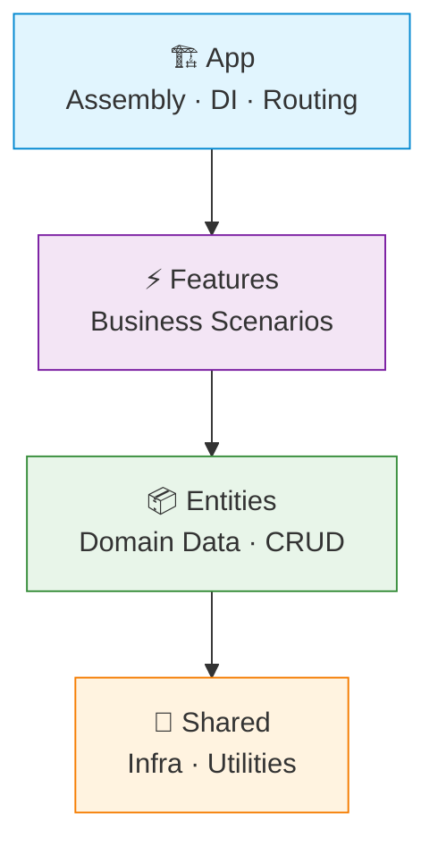
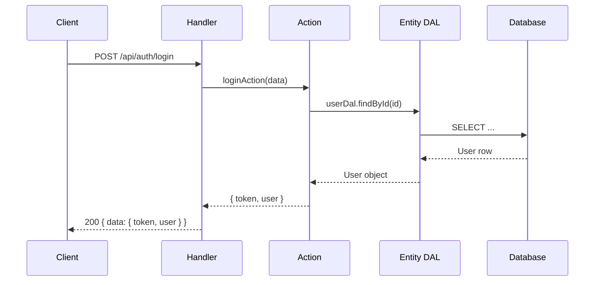
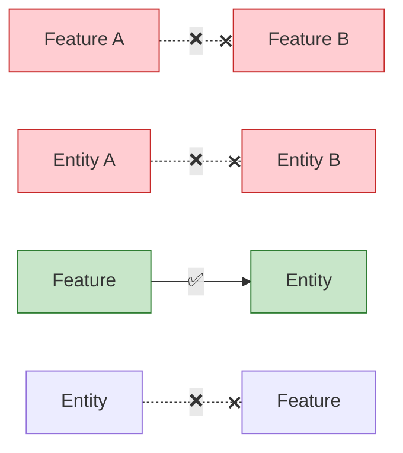

# 🍕 Feature-Action Architecture (FAA)

> **Slice your backend into features. Replace services with actions. Keep it clean.**

FAA is a backend adaptation of [Feature-Sliced Design](https://feature-sliced.design/) — an architecture where code is organized by **business domain** (vertical slices), and business logic lives in isolated **action functions** instead of monolithic service classes.

It's not tied to any language or paradigm. Use FP, OOP, or whatever works for you.
All examples here are in TypeScript + functional style, but the ideas are universal.

[](./README.RU.md)

---

## 📖 Table of Contents

- [🍕 Feature-Action Architecture (FAA)](#-feature-action-architecture-faa)
  - [📖 Table of Contents](#-table-of-contents)
  - [😩 The Problem](#-the-problem)
  - [🤔 What is FAA?](#-what-is-faa)
  - [🎯 Core Principles](#-core-principles)
  - [🏗️ Layer Hierarchy](#️-layer-hierarchy)
  - [📁 Project Structure](#-project-structure)
  - [⚡ Quick Example](#-quick-example)
    - [The Flow](#the-flow)
  - [🚦 Dependency Rules](#-dependency-rules)
  - [🔗 Connect FAA to Your Project](#-connect-faa-to-your-project)
    - [1) Link to this repository](#1-link-to-this-repository)
    - [2) Add FAA as a git submodule (recommended)](#2-add-faa-as-a-git-submodule-recommended)
  - [📚 Learn More](#-learn-more)
    - [Language Examples](#language-examples)

---

## 😩 The Problem

Traditional backend architecture gives you horizontal layers:

```
src/
├── controllers/    # Thin wrappers that call services
├── services/       # god objects that do everything
├── repositories/   # Data access, often duplicating service logic
└── models/         # Schemas, far away from the code that uses them
```

As the project grows:
- `UserService` becomes a 500-line monster handling auth, profiles, settings, notifications...
- Repositories duplicate service logic or become pass-through wrappers
- Adding a feature means touching 4+ directories
- Nobody knows whether a query belongs in a service or repository

**Sound familiar?**

---

## 🤔 What is FAA?

FAA flips the traditional approach:

| Traditional | FAA |
|---|---|
| Organize by **technical role** (controllers, services...) | Organize by **business domain** (auth, leaderboard...) |
| `UserService` class with 20 methods | `loginAction`, `getProfileAction` — one function, one job |
| Repositories with ambiguous boundaries | Data access lives where it's used |
| Implicit dependencies via imports | Explicit dependencies via factories + DI |

---

## 🎯 Core Principles

| # | Principle | TL;DR |
|---|---|---|
| 1 | 🍕 **Slice, don't layer** | No global `services/`, `controllers/`, `repositories/`. Organize by feature. |
| 2 | ⚡ **Actions over Services** | No `UserService` class. Write `loginAction` — one function, one job. |
| 3 | ⬇️ **Strict downward flow** | `App → Features → Entities → Shared`. Never up. Never sideways. |
| 4 | 📍 **Localize data access** | Generic CRUD → Entities. Complex queries → the Feature that needs them. |
| 5 | 🔌 **Explicit dependencies** | Factory functions + DI. No hidden globals. |

---

## 🏗️ Layer Hierarchy



| Layer | What it does | What it contains |
|---|---|---|
| **🏗️ App** | Assembles everything | Server init, DI container, router, middleware wiring (auth guards, rate limiting, etc.) |
| **⚡ Features** | Implements use cases | Actions, HTTP handlers, feature-specific queries |
| **📦 Entities** | Owns domain data | DB models, CRUD (DAL), reusable domain logic |
| **🔧 Shared** | Provides tools | Logger, DB drivers, config, HTTP utils, pure helpers, reusable middleware |

> [!IMPORTANT]
> Each layer can only import from layers **below** it. Never up, never sideways.

---

## 📁 Project Structure

```
src/
├── app/                          # 🏗️ Assembly
│   ├── container.ts              # DI wiring
│   ├── routes.ts                 # Registers routes from features
│   └── server.ts                 # Server init & lifecycle
│
├── features/                     # ⚡ Business Scenarios
│   ├── auth/
│   │   ├── api/handler.ts        # HTTP layer
│   │   ├── login.action.ts       # Business logic (THE action)
│   │   ├── lib/                  # Feature-local helpers
│   │   ├── types.ts
│   │   └── index.ts              # Public API
│   │
│   ├── leaderboard/
│   │   ├── race/                 # Sub-feature (independent!)
│   │   │   ├── api/handler.ts
│   │   │   ├── db/pipelines.ts   # Feature-specific queries
│   │   │   ├── get-race.action.ts
│   │   │   └── index.ts
│   │   └── ladder/
│   │       └── ...
│   └── ...
│
├── entities/                     # 📦 Domain Data
│   ├── user/
│   │   ├── model.ts              # DB schema
│   │   ├── dal.ts                # Generic CRUD
│   │   ├── lib/                  # Reusable domain logic
│   │   │   ├── queries.ts        # Complex reads (getOrCreate)
│   │   │   ├── commands.ts       # Complex writes (updatePrivacy)
│   │   │   └── helpers.ts        # Pure functions (normalizeName)
│   │   └── types.ts
│   └── ...
│
└── shared/                       # 🔧 Infrastructure
    ├── api/                      # HTTP primitives (errors, responses, middleware)
    ├── lib/                      # Pure functions (datetime, encoding)
    └── infra/                    # Drivers (DB, logger, config)
```

> [!TIP]
> Feature groups like `leaderboard/` are just folders for organization. Each subfolder (`race/`, `ladder/`) is an **independent feature** — no cross-imports allowed.

---

## ⚡ Quick Example

### The Flow



<details>
<summary>📦 <b>Entity — User DAL</b></summary>

```typescript
// entities/user/dal.ts
import { UserModel } from "./model";

export const createUserDal = () => ({
  findById: (id: number) =>
    UserModel.findOne({ user_id: id }).lean(),

  create: (userId: number, username?: string) =>
    UserModel.create({ user_id: userId, username }),
});
```

</details>

<details>
<summary>⚡ <b>Feature — Login Action</b></summary>

```typescript
// features/auth/login.action.ts
type Deps = {
  userDal: ReturnType<typeof createUserDal>;
  config: AppConfig;
};

export const createLoginAction = (deps: Deps) =>
  async (telegramData: TelegramAuth) => {
    let user = await deps.userDal.findById(telegramData.id);
    if (!user) {
      user = await deps.userDal.create(telegramData.id, telegramData.username);
    }
    const token = signToken(user, deps.config.secret);
    return { token, user };
  };

createLoginAction.inject = ["userDal", "config"] as const;
```

</details>

<details>
<summary>🌐 <b>Feature — HTTP Handler</b></summary>

```typescript
// features/auth/api/handler.ts
export const createLoginHandler = (login: ReturnType<typeof createLoginAction>) =>
  async (req: Request) => {
    const body = await req.json();
    const result = await login(body);
    return Response.json({ data: result });
  };

createLoginHandler.inject = ["loginAction"] as const;
```

</details>

<details>
<summary>🏗️ <b>App — Wiring it all together (for example, typed-inject)</b></summary>

```typescript
// app/container.ts
import { createInjector } from "typed-inject";

export const createContainer = () => {
  const config = loadConfig();

  return createInjector()
    .provideValue("config", config)
    .provideFactory("userDal", createUserDal)
    .provideFactory("loginAction", createLoginAction)
    .provideFactory("loginHandler", createLoginHandler);
};

const loginHandler = createContainer().resolve("loginHandler");
```

</details>

---

## 🚦 Dependency Rules



| Direction | Verdict | Example |
|---|---|---|
| Feature → Entity | ✅ Allowed | `login.action.ts` imports `userDal` |
| Feature → Shared | ✅ Allowed | Action imports `datetime` utility |
| Feature → Feature | ❌ Forbidden | Everything: code, types, errors. Push shared logic down to Entity |
| Entity → Entity | ❌ Forbidden | Entities are isolated |
| Entity → Feature | ❌ Forbidden | Never import upward |
| Shared → anything above | ❌ Forbidden | Shared is the foundation |

> [!WARNING]
> If two features need the same logic — **don't import horizontally**. Move the shared logic down to an Entity or Shared layer.

---

## 🔗 Connect FAA to Your Project

You have two ways to attach FAA documentation to your repo (for humans and AI agents):

### 1) Link to this repository

Add a link in your project prompt/README (`https://github.com/MairwunNx/Feature-Action-Architecture/blob/master/MANIFEST.md`).

This is quick, but **not always effective** — many LLM agents fetch links partially or ignore them depending on their tooling. That can lead to an incomplete picture.

### 2) Add FAA as a git submodule (recommended)

This makes the docs **local to the repo**, so agents can always read them.

**Git submodule declaration (example):**

```
# .gitmodules
[submodule "Feature-Action-Architecture"]
  path = Feature-Action-Architecture
  url = https://github.com/MairwunNx/Feature-Action-Architecture.git
```

or

```bash
git submodule add https://github.com/MairwunNx/Feature-Action-Architecture.git Feature-Action-Architecture
```

**Project prompt snippet (you can paste into your AI/project prompt):**

```
### Project architecture

All FAA (Feature-Action Architecture) docs live in `./Feature-Action-Architecture`.
Use the example closest to our stack.

Stack: <your stack here> # example: TS & Bun & typed-inject
Example: `Feature-Action-Architecture/examples/ts-bun.md`  # replace with your file

AI notes: `Feature-Action-Architecture/AI.md`
Architecture Manifest: `Feature-Action-Architecture/MANIFEST.md`
```

---

## 📚 Learn More

| Document | What's inside |
|---|---|
| 📜 [MANIFEST.md](./MANIFEST.md) | The philosophy, the "why", decision guide |
| 🤖 [AI.md](./AI.md) | Rules & patterns for AI/LLM agents working with FAA |

### Language Examples

Full working examples with project structure, DI wiring, and code snippets:

| Stack | Example |
|---|---|
| TypeScript + Bun | [examples/ts-bun.md](./examples/ts-bun.md) |
| Kotlin + Spring Boot | [examples/kotlin-springboot.md](./examples/kotlin-springboot.md) |
| Go + Gin + uber-fx | [examples/golang-gin.md](./examples/golang-gin.md) |
| Python + Django | [examples/python-django.md](./examples/python-django.md) |
| C# + ASP.NET Core | [examples/csharp-asp.md](./examples/csharp-asp.md) |
| Java + Spring Boot | [examples/java-springboot.md](./examples/java-springboot.md) |
| PHP + Laravel | [examples/php-laravel.md](./examples/php-laravel.md) |
| F# + Giraffe | [examples/fsharp-giraffe.md](./examples/fsharp-giraffe.md) |
| Rust + Axum | [examples/rust-axum.md](./examples/rust-axum.md) |

---

> [!NOTE]
> FAA is language-agnostic and paradigm-agnostic. FP, OOP, whatever — the principles apply.
> Examples here use TypeScript + functional style because that's what we like 🍕
