# FAA Example: C# + ASP.NET Core (.NET 10+)

> A simple **payment** feature — initiate payment, check status, list user payments.
>
> ASP.NET Core's built-in DI container handles dependency injection.

---

## Dependency Graph

```mermaid
graph TD
    APP["🏗️ App<br/>ASP.NET · DI · Middleware"] --> F_PAYMENT["⚡ Features/Payment"]
    APP --> F_BILLING["⚡ Features/Billing"]

    F_PAYMENT --> E_PAYMENT["📦 Entities/Payment"]
    F_PAYMENT --> E_USER["📦 Entities/User"]
    F_BILLING --> E_PAYMENT

    E_PAYMENT --> SHARED["🔧 Shared<br/>Config · HttpClient · Exceptions"]
    E_USER --> SHARED

    style APP fill:#e1f5fe,stroke:#0288d1
    style F_PAYMENT fill:#f3e5f5,stroke:#7b1fa2
    style F_BILLING fill:#f3e5f5,stroke:#7b1fa2
    style E_PAYMENT fill:#e8f5e9,stroke:#388e3c
    style E_USER fill:#e8f5e9,stroke:#388e3c
    style SHARED fill:#fff3e0,stroke:#f57c00
```



---

## Project Structure

```
src/
├── App/
│   └── Program.cs                # DI wiring + middleware + routes
├── Features/
│   ├── Payment/
│   │   ├── Api/
│   │   │   └── PaymentEndpoints.cs   # Minimal API (thin)
│   │   ├── InitiatePaymentAction.cs
│   │   ├── CheckStatusAction.cs
│   │   └── Dto/
│   │       └── PaymentDto.cs
│   └── Billing/
│       ├── Api/
│       │   └── BillingEndpoints.cs
│       └── GetInvoiceAction.cs
├── Entities/
│   ├── Payment/
│   │   ├── Payment.cs                # EF entity
│   │   ├── PaymentDal.cs             # CRUD
│   │   └── Lib/
│   │       └── PaymentQueries.cs     # Complex reads
│   └── User/
│       ├── User.cs
│       └── UserDal.cs
└── Shared/
    ├── Api/
    │   └── AppException.cs
    ├── Infra/
    │   └── AppDbContext.cs
    └── Lib/
        └── MoneyFormatter.cs
```

> [!NOTE]
> This is a minimal example structure. In a real project you may add more features, entities, and shared utilities as needed.

> Module boundaries in C# are enforced by `internal` access modifier. Classes used only within a feature should be `internal`, not `public`.

---

## Shared — Exception

```csharp
// Shared/Api/AppException.cs
namespace App.Shared.Api;

public class AppException(int statusCode, string message) : Exception(message)
{
    public int StatusCode { get; } = statusCode;
}

public class NotFoundException(string message) : AppException(404, message);
public class BadRequestException(string message) : AppException(400, message);
```

---

## Entity — Payment

```csharp
// Entities/Payment/Payment.cs
namespace App.Entities.Payment;

public class Payment
{
    public int Id { get; set; }
    public int UserId { get; set; }
    public decimal Amount { get; set; }
    public string Currency { get; set; } = "USD";
    public string Status { get; set; } = "pending";  // pending, completed, failed
    public string? ExternalId { get; set; }
    public DateTime CreatedAt { get; set; } = DateTime.UtcNow;
}
```

```csharp
// Entities/Payment/PaymentDal.cs
namespace App.Entities.Payment;

public class PaymentDal(AppDbContext db)
{
    public async Task<Payment?> FindByIdAsync(int id) =>
        await db.Payments.FindAsync(id);

    public async Task<List<Payment>> FindByUserIdAsync(int userId) =>
        await db.Payments
            .Where(p => p.UserId == userId)
            .OrderByDescending(p => p.CreatedAt)
            .ToListAsync();

    public async Task<Payment> CreateAsync(Payment payment)
    {
        db.Payments.Add(payment);
        await db.SaveChangesAsync();
        return payment;
    }

    public async Task UpdateStatusAsync(int id, string status)
    {
        await db.Payments
            .Where(p => p.Id == id)
            .ExecuteUpdateAsync(p => p.SetProperty(x => x.Status, status));
    }
}
```

---

## Feature — Initiate Payment (Action)

```csharp
// Features/Payment/InitiatePaymentAction.cs
namespace App.Features.Payment;

public class InitiatePaymentAction(
    PaymentDal paymentDal,
    UserDal userDal,
    IHttpClientFactory httpFactory
)
{
    public async Task<PaymentDto> ExecuteAsync(int userId, decimal amount, string currency)
    {
        var user = await userDal.FindByIdAsync(userId)
            ?? throw new NotFoundException("User not found");

        // call external payment provider
        var client = httpFactory.CreateClient("stripe");
        var externalId = await CreateExternalCharge(client, amount, currency);

        var payment = await paymentDal.CreateAsync(new Payment
        {
            UserId = userId,
            Amount = amount,
            Currency = currency,
            ExternalId = externalId,
        });

        return new PaymentDto(payment.Id, payment.Amount, payment.Currency, payment.Status);
    }

    private static async Task<string> CreateExternalCharge(
        HttpClient client, decimal amount, string currency)
    {
        // POST to payment provider, return their charge ID
        var response = await client.PostAsJsonAsync("/charges", new { amount, currency });
        response.EnsureSuccessStatusCode();
        var result = await response.Content.ReadFromJsonAsync<ChargeResponse>();
        return result!.Id;
    }
}
```

---

## Feature — Check Status (Action)

```csharp
// Features/Payment/CheckStatusAction.cs
namespace App.Features.Payment;

public class CheckStatusAction(PaymentDal paymentDal)
{
    public async Task<PaymentDto> ExecuteAsync(int paymentId)
    {
        var payment = await paymentDal.FindByIdAsync(paymentId)
            ?? throw new NotFoundException("Payment not found");

        return new PaymentDto(payment.Id, payment.Amount, payment.Currency, payment.Status);
    }
}
```

---

## Feature — Endpoints (thin)

```csharp
// Features/Payment/Api/PaymentEndpoints.cs
namespace App.Features.Payment.Api;

public static class PaymentEndpoints
{
    public static void MapPaymentEndpoints(this IEndpointRouteBuilder app)
    {
        var group = app.MapGroup("/api/payments");

        group.MapPost("/", async (InitiatePaymentAction action, CreatePaymentRequest req) =>
        {
            var result = await action.ExecuteAsync(req.UserId, req.Amount, req.Currency);
            return Results.Created($"/api/payments/{result.Id}", result);
        });

        group.MapGet("/{id:int}", async (CheckStatusAction action, int id) =>
        {
            var result = await action.ExecuteAsync(id);
            return Results.Ok(result);
        });
    }
}
```

---

## App — Wiring

```csharp
// App/Program.cs
var builder = WebApplication.CreateBuilder(args);

// Shared
builder.Services.AddDbContext<AppDbContext>();
builder.Services.AddHttpClient("stripe", c => c.BaseAddress = new Uri("https://api.stripe.com"));

// Entities
builder.Services.AddScoped<PaymentDal>();
builder.Services.AddScoped<UserDal>();

// Features
builder.Services.AddScoped<InitiatePaymentAction>();
builder.Services.AddScoped<CheckStatusAction>();
builder.Services.AddScoped<GetInvoiceAction>();

var app = builder.Build();

// Routes
app.MapPaymentEndpoints();
app.MapBillingEndpoints();

app.Run();
```

---

## What FAA gives you here

| Without FAA | With FAA |
|---|---|
| `PaymentService` with initiate + check + refund + webhook in one class | `InitiatePaymentAction` — one class, one job |
| HTTP client call buried in service internals | Dependencies are explicit via constructor injection |
| Controller doing validation + orchestration | Minimal API endpoint just parses and delegates |
| Unclear which features touch the payments table | `Entities/Payment/` owns the data, features only use DAL |
