# FAA Example: F# + Giraffe

> A simple **leaderboard** feature — submit score, get top players, get user rank.
>
> Dependencies are wired via partial function application — no DI framework needed.

---

## Dependency Graph

```mermaid
graph TD
    APP["🏗️ App<br/>Giraffe · WebApp · Routes"] --> F_BOARD["⚡ Features/Leaderboard"]
    APP --> F_PROFILE["⚡ Features/Profile"]

    F_BOARD --> E_SCORE["📦 Entities/Score"]
    F_PROFILE --> E_SCORE

    E_SCORE --> SHARED["🔧 Shared<br/>config · db connection"]

    style APP fill:#e1f5fe,stroke:#0288d1
    style F_BOARD fill:#f3e5f5,stroke:#7b1fa2
    style F_PROFILE fill:#f3e5f5,stroke:#7b1fa2
    style E_SCORE fill:#e8f5e9,stroke:#388e3c
    style SHARED fill:#fff3e0,stroke:#f57c00
```



---

## Project Structure

```
src/
├── Shared/
│   ├── Config.fs
│   └── Database.fs
├── Entities/
│   └── Score/
│       ├── Model.fs
│       └── Dal.fs
├── Features/
│   ├── Leaderboard/
│   │   ├── Types.fs
│   │   ├── SubmitScoreAction.fs
│   │   ├── GetTopAction.fs
│   │   └── Handler.fs
│   └── Profile/
│       ├── GetRankAction.fs
│       └── Handler.fs
└── App/
    ├── Deps.fs          # Wires all dependencies into a record
    └── Program.fs       # Giraffe app entry point
App.fsproj               # Files listed in compilation order (bottom-up)
```

> [!NOTE]
> In F#, files must be declared in `.fsproj` in dependency order: `Shared` first, then `Entities`, then `Features`, then `App`.

---

## Shared — Config & DB

```fsharp
// Shared/Config.fs
module Shared.Config

type AppConfig = {
    DbConnectionString: string
    Port: int
}

let load () = {
    DbConnectionString = Env.getOrDefault "DATABASE_URL" "Host=localhost;Database=app"
    Port = Env.getIntOrDefault "PORT" 8080
}
```

```fsharp
// Shared/Database.fs
module Shared.Database

open Npgsql

let createConnection (connStr: string) =
    let conn = new NpgsqlConnection(connStr)
    conn.Open()
    conn
```

---

## Entity — Score

```fsharp
// Entities/Score/Model.fs
module Entities.Score.Model

type Score = {
    UserId: int
    Username: string
    Value: int
    UpdatedAt: System.DateTime
}
```

```fsharp
// Entities/Score/Dal.fs
module Entities.Score.Dal

open Npgsql
open Entities.Score.Model

type ScoreDal = {
    Upsert: int -> string -> int -> Async<Score>
    FindByUserId: int -> Async<Score option>
    GetTop: int -> Async<Score list>
}

let create (conn: NpgsqlConnection) : ScoreDal = {
    Upsert = fun userId username value ->
        async {
            // INSERT ... ON CONFLICT DO UPDATE
            return { UserId = userId; Username = username; Value = value; UpdatedAt = System.DateTime.UtcNow }
        }

    FindByUserId = fun userId ->
        async {
            // SELECT ... WHERE user_id = @userId
            return None // placeholder
        }

    GetTop = fun limit ->
        async {
            // SELECT ... ORDER BY value DESC LIMIT @limit
            return []
        }
}
```

---

## Feature — Leaderboard

```fsharp
// Features/Leaderboard/Types.fs
module Features.Leaderboard.Types

type SubmitScoreInput = { UserId: int; Username: string; Score: int }
type ScoreResult = { UserId: int; Username: string; Score: int }
type TopResult = { Rank: int; UserId: int; Username: string; Score: int }
```

```fsharp
// Features/Leaderboard/SubmitScoreAction.fs
module Features.Leaderboard.SubmitScoreAction

open Entities.Score.Dal
open Features.Leaderboard.Types

// Action is a function: deps -> input -> result
// Partial application binds deps at wiring time
let execute (dal: ScoreDal) (input: SubmitScoreInput) =
    async {
        let! score = dal.Upsert input.UserId input.Username input.Score
        return { UserId = score.UserId; Username = score.Username; Score = score.Value }
    }
```

```fsharp
// Features/Leaderboard/GetTopAction.fs
module Features.Leaderboard.GetTopAction

open Entities.Score.Dal
open Features.Leaderboard.Types

let execute (dal: ScoreDal) (limit: int) =
    async {
        let! scores = dal.GetTop limit
        return scores
               |> List.mapi (fun i s -> { Rank = i + 1; UserId = s.UserId; Username = s.Username; Score = s.Value })
    }
```

```fsharp
// Features/Leaderboard/Handler.fs
module Features.Leaderboard.Handler

open Giraffe
open Features.Leaderboard.Types

// Handler is thin: parse → call action → respond
let submitScore (submitScoreAction: SubmitScoreInput -> Async<ScoreResult>) : HttpHandler =
    fun next ctx ->
        task {
            let! input = ctx.BindJsonAsync<SubmitScoreInput>()
            let! result = submitScoreAction input |> Async.StartAsTask
            return! json result next ctx
        }

let getTop (getTopAction: int -> Async<TopResult list>) : HttpHandler =
    fun next ctx ->
        task {
            let limit = ctx.TryGetQueryStringValue "limit" |> Option.map int |> Option.defaultValue 10
            let! result = getTopAction limit |> Async.StartAsTask
            return! json result next ctx
        }
```

---

## Feature — Profile

```fsharp
// Features/Profile/GetRankAction.fs
module Features.Profile.GetRankAction

open Entities.Score.Dal

type RankResult = { UserId: int; Score: int; Rank: int }

let execute (dal: ScoreDal) (userId: int) =
    async {
        let! score = dal.FindByUserId userId
        match score with
        | None -> return Error "User has no score"
        | Some s ->
            let! top = dal.GetTop System.Int32.MaxValue
            let rank = top |> List.findIndex (fun x -> x.UserId = userId) |> (+) 1
            return Ok { UserId = s.UserId; Score = s.Value; Rank = rank }
    }
```

---

## App — Wiring

```fsharp
// App/Deps.fs
module App.Deps

open Entities.Score.Dal
open Features.Leaderboard

// All deps in one record — the "container"
type AppDeps = {
    SubmitScore: Types.SubmitScoreInput -> Async<Types.ScoreResult>
    GetTop: int -> Async<Types.TopResult list>
    GetRank: int -> Async<Result<Features.Profile.GetRankAction.RankResult, string>>
}

let create (config: Shared.Config.AppConfig) =
    let conn = Shared.Database.createConnection config.DbConnectionString
    let scoreDal = Entities.Score.Dal.create conn

    // Partial application: bind deps into actions
    {
        SubmitScore = SubmitScoreAction.execute scoreDal
        GetTop      = GetTopAction.execute scoreDal
        GetRank     = Features.Profile.GetRankAction.execute scoreDal
    }
```

```fsharp
// App/Program.fs
module App.Program

open Giraffe
open Microsoft.AspNetCore.Builder
open Microsoft.Extensions.DependencyInjection
open Features.Leaderboard.Handler

[<EntryPoint>]
let main _ =
    let config = Shared.Config.load ()
    let deps = App.Deps.create config

    let webApp =
        choose [
            POST >=> route "/api/leaderboard/scores" >=> submitScore deps.SubmitScore
            GET  >=> route "/api/leaderboard/top"    >=> getTop deps.GetTop
        ]

    let builder = WebApplication.CreateBuilder()
    builder.Services.AddGiraffe() |> ignore
    let app = builder.Build()
    app.UseGiraffe(webApp)
    app.Run($"http://0.0.0.0:{config.Port}")
    0
```

---

## What FAA gives you here

| Without FAA | With FAA |
|---|---|
| Mutable state or global singletons | All deps explicit in `AppDeps` record |
| Functions scattered across modules with implicit dependencies | `SubmitScoreAction.execute scoreDal` — dependency obvious from the call site |
| Testing requires real DB or complex setup | Pass a mock `ScoreDal` record — no infrastructure needed |
| Service classes mixing read and write concerns | `SubmitScoreAction`, `GetTopAction` — each function does one thing |
