# FAA Example: Go + Gin + uber-fx

> A simple **task management** feature — create task, complete task, list tasks.
>
> [uber-fx](https://github.com/uber-go/fx) handles dependency injection.

---

## Dependency Graph

```mermaid
graph TD
    APP["🏗️ App<br/>Gin server · uber-fx · Routes"] --> F_TASK["⚡ features/task"]
    APP --> F_DASHBOARD["⚡ features/dashboard"]

    F_TASK --> E_TASK["📦 entities/task"]
    F_DASHBOARD --> E_TASK

    E_TASK --> SHARED["🔧 shared<br/>config · logger · db"]

    style APP fill:#e1f5fe,stroke:#0288d1
    style F_TASK fill:#f3e5f5,stroke:#7b1fa2
    style F_DASHBOARD fill:#f3e5f5,stroke:#7b1fa2
    style E_TASK fill:#e8f5e9,stroke:#388e3c
    style SHARED fill:#fff3e0,stroke:#f57c00
```



---

## Project Structure

```
internal/
├── app/
│   ├── app.go                # fx.New, module wiring
│   └── routes.go             # Register routes
├── features/
│   ├── task/
│   │   ├── handler.go        # HTTP layer (thin)
│   │   ├── create_task.go    # Action
│   │   ├── complete_task.go  # Action
│   │   └── list_tasks.go     # Action
│   └── dashboard/
│       ├── handler.go
│       └── get_summary.go    # Action
├── entities/
│   └── task/
│       ├── model.go          # DB struct + table name
│       ├── dal.go            # CRUD operations
│       └── queries.go        # Reusable complex reads
└── shared/
    ├── infra/
    │   ├── config.go
    │   ├── postgres.go
    │   └── logger.go
    └── lib/
        └── timeutil.go
```

> [!NOTE]
> This is a minimal example structure. In a real project you may add more features, entities, and shared utilities as needed.

> Go enforces module boundaries with unexported names (lowercase). No barrel files needed.

---

## Shared — Config

```go
// shared/infra/config.go
package infra

import "os"

type Config struct {
	Port   string
	DBUrl  string
}

func NewConfig() *Config {
	return &Config{
		Port:  getEnv("PORT", "8080"),
		DBUrl: getEnv("DATABASE_URL", "postgres://localhost:5432/app"),
	}
}

func getEnv(key, fallback string) string {
	if v := os.Getenv(key); v != "" {
		return v
	}
	return fallback
}
```

---

## Entity — Task

```go
// entities/task/model.go
package task

import "time"

type Task struct {
	ID          int       `db:"id"          json:"id"`
	UserID      int       `db:"user_id"     json:"user_id"`
	Title       string    `db:"title"       json:"title"`
	Description string    `db:"description" json:"description"`
	Done        bool      `db:"done"        json:"done"`
	CreatedAt   time.Time `db:"created_at"  json:"created_at"`
}
```

```go
// entities/task/dal.go
package task

import "github.com/jmoiron/sqlx"

type Dal struct {
	db *sqlx.DB
}

func NewDal(db *sqlx.DB) *Dal {
	return &Dal{db: db}
}

func (d *Dal) FindByID(id int) (*Task, error) {
	var t Task
	err := d.db.Get(&t, "SELECT * FROM tasks WHERE id = $1", id)
	return &t, err
}

func (d *Dal) FindByUserID(userID int) ([]Task, error) {
	var tasks []Task
	err := d.db.Select(&tasks, "SELECT * FROM tasks WHERE user_id = $1 ORDER BY created_at DESC", userID)
	return tasks, err
}

func (d *Dal) Create(t *Task) error {
	_, err := d.db.NamedExec(
		"INSERT INTO tasks (user_id, title, description) VALUES (:user_id, :title, :description)",
		t,
	)
	return err
}

func (d *Dal) MarkDone(id int) error {
	_, err := d.db.Exec("UPDATE tasks SET done = true WHERE id = $1", id)
	return err
}
```

---

## Feature — Create Task (Action)

```go
// features/task/create_task.go
package task

import (
	taskEntity "myapp/internal/entities/task"
)

type CreateTaskAction struct {
	dal *taskEntity.Dal
}

func NewCreateTaskAction(dal *taskEntity.Dal) *CreateTaskAction {
	return &CreateTaskAction{dal: dal}
}

type CreateTaskInput struct {
	UserID      int    `json:"user_id" binding:"required"`
	Title       string `json:"title" binding:"required"`
	Description string `json:"description"`
}

func (a *CreateTaskAction) Execute(input CreateTaskInput) error {
	task := &taskEntity.Task{
		UserID:      input.UserID,
		Title:       input.Title,
		Description: input.Description,
	}
	return a.dal.Create(task)
}
```

---

## Feature — Complete Task (Action)

```go
// features/task/complete_task.go
package task

import (
	"errors"
	taskEntity "myapp/internal/entities/task"
)

type CompleteTaskAction struct {
	dal *taskEntity.Dal
}

func NewCompleteTaskAction(dal *taskEntity.Dal) *CompleteTaskAction {
	return &CompleteTaskAction{dal: dal}
}

func (a *CompleteTaskAction) Execute(taskID int, userID int) error {
	task, err := a.dal.FindByID(taskID)
	if err != nil {
		return errors.New("task not found")
	}
	if task.UserID != userID {
		return errors.New("forbidden")
	}
	if task.Done {
		return errors.New("task already completed")
	}
	return a.dal.MarkDone(taskID)
}
```

---

## Feature — Handler (thin)

```go
// features/task/handler.go
package task

import (
	"net/http"
	"strconv"

	"github.com/gin-gonic/gin"
)

type Handler struct {
	createTask   *CreateTaskAction
	completeTask *CompleteTaskAction
	listTasks    *ListTasksAction
}

func NewHandler(
	create *CreateTaskAction,
	complete *CompleteTaskAction,
	list *ListTasksAction,
) *Handler {
	return &Handler{
		createTask:   create,
		completeTask: complete,
		listTasks:    list,
	}
}

func (h *Handler) RegisterRoutes(r *gin.RouterGroup) {
	r.POST("/tasks", h.create)
	r.PATCH("/tasks/:id/complete", h.complete)
	r.GET("/tasks", h.list)
}

func (h *Handler) create(c *gin.Context) {
	var input CreateTaskInput
	if err := c.ShouldBindJSON(&input); err != nil {
		c.JSON(http.StatusBadRequest, gin.H{"error": err.Error()})
		return
	}
	if err := h.createTask.Execute(input); err != nil {
		c.JSON(http.StatusInternalServerError, gin.H{"error": err.Error()})
		return
	}
	c.Status(http.StatusCreated)
}

func (h *Handler) complete(c *gin.Context) {
	taskID, _ := strconv.Atoi(c.Param("id"))
	userID := c.GetInt("user_id") // from auth middleware
	if err := h.completeTask.Execute(taskID, userID); err != nil {
		c.JSON(http.StatusBadRequest, gin.H{"error": err.Error()})
		return
	}
	c.JSON(http.StatusOK, gin.H{"status": "completed"})
}

func (h *Handler) list(c *gin.Context) {
	userID := c.GetInt("user_id")
	tasks, err := h.listTasks.Execute(userID)
	if err != nil {
		c.JSON(http.StatusInternalServerError, gin.H{"error": err.Error()})
		return
	}
	c.JSON(http.StatusOK, gin.H{"data": tasks})
}
```

---

## App — Wiring with uber-fx

```go
// app/app.go
package app

import (
	"go.uber.org/fx"

	"myapp/internal/shared/infra"
	taskEntity "myapp/internal/entities/task"
	taskFeature "myapp/internal/features/task"
)

func New() *fx.App {
	return fx.New(
		// Shared
		fx.Provide(infra.NewConfig),
		fx.Provide(infra.NewPostgres),

		// Entities
		fx.Provide(taskEntity.NewDal),

		// Features
		fx.Provide(taskFeature.NewCreateTaskAction),
		fx.Provide(taskFeature.NewCompleteTaskAction),
		fx.Provide(taskFeature.NewListTasksAction),
		fx.Provide(taskFeature.NewHandler),

		// Server
		fx.Invoke(startServer),
	)
}
```

---

## What FAA gives you here

| Without FAA | With FAA |
|---|---|
| `TaskService` struct with 10 methods | `CreateTaskAction`, `CompleteTaskAction` — one struct, one job |
| Ownership check mixed with DB update logic | Business rules in action, DB ops in DAL |
| `handlers/task.go` doing validation + logic + DB | Handler just parses request and calls action |
| Need to read the whole service to understand completion flow | Open `complete_task.go` — everything is right there |
