# FAA Example: Java + Spring Boot

> A simple **inventory management** feature — add item, update stock, list items by category.
>
> Spring Boot wires dependencies automatically via constructor injection — no explicit container file needed.

---

## Dependency Graph

```mermaid
graph TD
    APP["🏗️ App<br/>Spring Boot · Auto-config · Routes"] --> F_INVENTORY["⚡ features/inventory"]
    APP --> F_CATALOG["⚡ features/catalog"]

    F_INVENTORY --> E_ITEM["📦 entities/item"]
    F_CATALOG --> E_ITEM

    E_ITEM --> SHARED["🔧 shared<br/>config · api response"]

    style APP fill:#e1f5fe,stroke:#0288d1
    style F_INVENTORY fill:#f3e5f5,stroke:#7b1fa2
    style F_CATALOG fill:#f3e5f5,stroke:#7b1fa2
    style E_ITEM fill:#e8f5e9,stroke:#388e3c
    style SHARED fill:#fff3e0,stroke:#f57c00
```



---

## Project Structure

```
src/main/java/com/example/
├── app/
│   └── Application.java                    # @SpringBootApplication
├── features/
│   ├── inventory/
│   │   ├── api/
│   │   │   └── InventoryController.java    # @RestController (thin handler)
│   │   ├── CreateItemAction.java           # @Component
│   │   ├── UpdateStockAction.java          # @Component
│   │   └── dto/
│   │       ├── CreateItemRequest.java
│   │       └── ItemResponse.java
│   └── catalog/
│       ├── api/
│       │   └── CatalogController.java
│       ├── ListItemsAction.java            # @Component
│       └── dto/
│           └── CategoryItemsResponse.java
├── entities/
│   └── item/
│       ├── Item.java                       # @Entity
│       ├── ItemDal.java                    # @Repository (Spring Data JPA)
│       └── ItemNotFoundException.java
└── shared/
    └── api/
        └── ApiResponse.java
```

> [!NOTE]
> Spring Boot scans `@Component`, `@Repository`, and `@RestController` automatically.
> Actions are plain `@Component` classes — no `@Service` naming to avoid confusion with the service-layer antipattern.

---

## Shared — API Response

```java
// shared/api/ApiResponse.java
public record ApiResponse<T>(T data) {
    public static <T> ApiResponse<T> of(T data) {
        return new ApiResponse<>(data);
    }
}
```

---

## Entity — Item

```java
// entities/item/Item.java
@Entity
@Table(name = "items")
public class Item {
    @Id @GeneratedValue(strategy = GenerationType.IDENTITY)
    private Long id;
    private String name;
    private String category;
    private int quantity;
    private BigDecimal price;
    // constructors, getters, setters
}
```

```java
// entities/item/ItemDal.java
@Repository
public interface ItemDal extends JpaRepository<Item, Long> {
    List<Item> findByCategory(String category);
}
```

```java
// entities/item/ItemNotFoundException.java
public class ItemNotFoundException extends RuntimeException {
    public ItemNotFoundException(Long id) {
        super("Item not found: " + id);
    }
}
```

---

## Feature — Inventory

```java
// features/inventory/CreateItemAction.java
@Component
public class CreateItemAction {
    private final ItemDal itemDal;

    public CreateItemAction(ItemDal itemDal) {
        this.itemDal = itemDal;
    }

    public ItemResponse execute(CreateItemRequest request) {
        var item = new Item();
        item.setName(request.name());
        item.setCategory(request.category());
        item.setQuantity(request.quantity());
        item.setPrice(request.price());

        return ItemResponse.from(itemDal.save(item));
    }
}
```

```java
// features/inventory/UpdateStockAction.java
@Component
public class UpdateStockAction {
    private final ItemDal itemDal;

    public UpdateStockAction(ItemDal itemDal) {
        this.itemDal = itemDal;
    }

    public ItemResponse execute(Long itemId, int delta) {
        var item = itemDal.findById(itemId)
            .orElseThrow(() -> new ItemNotFoundException(itemId));

        item.setQuantity(item.getQuantity() + delta);
        return ItemResponse.from(itemDal.save(item));
    }
}
```

```java
// features/inventory/api/InventoryController.java
@RestController
@RequestMapping("/api/inventory")
public class InventoryController {
    private final CreateItemAction createItem;
    private final UpdateStockAction updateStock;

    public InventoryController(CreateItemAction createItem, UpdateStockAction updateStock) {
        this.createItem = createItem;
        this.updateStock = updateStock;
    }

    @PostMapping
    public ResponseEntity<ApiResponse<ItemResponse>> create(@RequestBody CreateItemRequest request) {
        return ResponseEntity.status(201).body(ApiResponse.of(createItem.execute(request)));
    }

    @PatchMapping("/{id}/stock")
    public ResponseEntity<ApiResponse<ItemResponse>> updateStock(
            @PathVariable Long id, @RequestParam int delta) {
        return ResponseEntity.ok(ApiResponse.of(updateStock.execute(id, delta)));
    }
}
```

---

## Feature — Catalog

```java
// features/catalog/ListItemsAction.java
@Component
public class ListItemsAction {
    private final ItemDal itemDal;

    public ListItemsAction(ItemDal itemDal) {
        this.itemDal = itemDal;
    }

    public List<ItemResponse> execute(String category) {
        return itemDal.findByCategory(category)
            .stream()
            .map(ItemResponse::from)
            .toList();
    }
}
```

```java
// features/catalog/api/CatalogController.java
@RestController
@RequestMapping("/api/catalog")
public class CatalogController {
    private final ListItemsAction listItems;

    public CatalogController(ListItemsAction listItems) {
        this.listItems = listItems;
    }

    @GetMapping
    public ResponseEntity<ApiResponse<List<ItemResponse>>> listByCategory(@RequestParam String category) {
        return ResponseEntity.ok(ApiResponse.of(listItems.execute(category)));
    }
}
```

---

## App — Entry Point

```java
// app/Application.java
@SpringBootApplication
public class Application {
    public static void main(String[] args) {
        SpringApplication.run(Application.class, args);
    }
}
```

> [!NOTE]
> Spring Boot discovers and wires all components automatically. The container registration order (Shared → Entities → Features) is handled by Spring's dependency graph — just declare constructor dependencies and it resolves them.

---

## What FAA gives you here

| Without FAA | With FAA |
|---|---|
| `ItemService` with `create`, `updateStock`, `listByCategory`, `getById`... | `CreateItemAction`, `UpdateStockAction`, `ListItemsAction` — one class, one job |
| Business logic mixed into `@Service` classes | Logic in focused actions; DAL is a plain Spring Data interface |
| Monolithic service becomes a merge conflict magnet | Each action is a separate file — no conflicts |
| Testing requires mocking the entire service | Each action tested with only its direct dependency mocked |
