# FAA Example: Kotlin + Spring Boot

> A simple **order placement** feature — create order, get order, list user orders.
>
> Spring's DI container handles dependency injection natively.

---

## Dependency Graph

```mermaid
graph TD
    APP["🏗️ App<br/>Spring Boot · DI · Routes"] --> F_ORDER["⚡ features/order"]
    APP --> F_CATALOG["⚡ features/catalog"]

    F_ORDER --> E_ORDER["📦 entities/order"]
    F_ORDER --> E_PRODUCT["📦 entities/product"]
    F_CATALOG --> E_PRODUCT

    E_ORDER --> SHARED["🔧 shared<br/>config · exceptions · utils"]
    E_PRODUCT --> SHARED

    style APP fill:#e1f5fe,stroke:#0288d1
    style F_ORDER fill:#f3e5f5,stroke:#7b1fa2
    style F_CATALOG fill:#f3e5f5,stroke:#7b1fa2
    style E_ORDER fill:#e8f5e9,stroke:#388e3c
    style E_PRODUCT fill:#e8f5e9,stroke:#388e3c
    style SHARED fill:#fff3e0,stroke:#f57c00
```



---

## Project Structure

```
src/main/kotlin/com/example/shop/
├── app/
│   └── ShopApplication.kt
├── features/
│   ├── order/
│   │   ├── api/OrderController.kt
│   │   ├── CreateOrderAction.kt
│   │   ├── GetOrderAction.kt
│   │   └── dto/
│   │       └── OrderDto.kt
│   └── catalog/
│       ├── api/CatalogController.kt
│       ├── ListProductsAction.kt
│       └── dto/
│           └── ProductDto.kt
├── entities/
│   ├── order/
│   │   ├── Order.kt              # JPA entity
│   │   ├── OrderDal.kt           # Repository (CRUD)
│   │   └── lib/
│   │       └── OrderQueries.kt   # Complex reads
│   └── product/
│       ├── Product.kt
│       └── ProductDal.kt
└── shared/
    ├── api/
    │   ├── AppException.kt
    │   └── GlobalExceptionHandler.kt
    └── lib/
        └── MoneyUtils.kt
```

> [!NOTE]
> This is a minimal example structure. In a real project you may add more features, entities, and shared utilities as needed.

> Module boundaries are enforced by Kotlin's `internal` visibility. No barrel files needed.

---

## Shared — Exceptions

```kotlin
// shared/api/AppException.kt
package com.example.shop.shared.api

open class AppException(
    val status: Int,
    override val message: String,
) : RuntimeException(message)

class NotFoundException(message: String) : AppException(404, message)
class BadRequestException(message: String) : AppException(400, message)
```

---

## Entity — Product

```kotlin
// entities/product/Product.kt
@Entity
@Table(name = "products")
data class Product(
    @Id @GeneratedValue(strategy = GenerationType.IDENTITY)
    val id: Long = 0,
    val name: String,
    val priceInCents: Int,
    val stock: Int,
)
```

```kotlin
// entities/product/ProductDal.kt
@Repository
interface ProductDal : JpaRepository<Product, Long> {
    fun findByIdIn(ids: List<Long>): List<Product>
}
```

---

## Entity — Order

```kotlin
// entities/order/Order.kt
@Entity
@Table(name = "orders")
data class Order(
    @Id @GeneratedValue(strategy = GenerationType.IDENTITY)
    val id: Long = 0,
    val userId: Long,
    val totalCents: Int,
    val status: String = "pending",
    val createdAt: Instant = Instant.now(),

    @OneToMany(cascade = [CascadeType.ALL], mappedBy = "order")
    val items: List<OrderItem> = emptyList(),
)

@Entity
@Table(name = "order_items")
data class OrderItem(
    @Id @GeneratedValue(strategy = GenerationType.IDENTITY)
    val id: Long = 0,
    val productId: Long,
    val quantity: Int,
    val priceInCents: Int,

    @ManyToOne @JoinColumn(name = "order_id")
    val order: Order? = null,
)
```

```kotlin
// entities/order/OrderDal.kt
@Repository
interface OrderDal : JpaRepository<Order, Long> {
    fun findByUserId(userId: Long): List<Order>
}
```

---

## Feature — Create Order

```kotlin
// features/order/CreateOrderAction.kt
@Service
class CreateOrderAction(
    private val orderDal: OrderDal,
    private val productDal: ProductDal,
) {
    @Transactional
    fun execute(input: CreateOrderRequest): OrderDto {
        val products = productDal.findByIdIn(input.items.map { it.productId })

        // validate stock
        input.items.forEach { item ->
            val product = products.find { it.id == item.productId }
                ?: throw NotFoundException("Product ${item.productId} not found")
            if (product.stock < item.quantity)
                throw BadRequestException("Not enough stock for ${product.name}")
        }

        // calculate total
        val totalCents = input.items.sumOf { item ->
            val product = products.first { it.id == item.productId }
            product.priceInCents * item.quantity
        }

        val order = orderDal.save(
            Order(
                userId = input.userId,
                totalCents = totalCents,
                items = input.items.map { item ->
                    val product = products.first { it.id == item.productId }
                    OrderItem(
                        productId = item.productId,
                        quantity = item.quantity,
                        priceInCents = product.priceInCents,
                    )
                },
            )
        )

        return order.toDto()
    }
}
```

---

## Feature — Controller (thin)

```kotlin
// features/order/api/OrderController.kt
@RestController
@RequestMapping("/api/orders")
class OrderController(
    private val createOrder: CreateOrderAction,
    private val getOrder: GetOrderAction,
) {
    @PostMapping
    fun create(@RequestBody request: CreateOrderRequest): ResponseEntity<OrderDto> {
        val result = createOrder.execute(request)
        return ResponseEntity.status(201).body(result)
    }

    @GetMapping("/{id}")
    fun get(@PathVariable id: Long): OrderDto =
        getOrder.execute(id)

    @GetMapping("/user/{userId}")
    fun listByUser(@PathVariable userId: Long): List<OrderDto> =
        getOrder.listByUser(userId)
}
```

---

## What FAA gives you here

| Without FAA | With FAA |
|---|---|
| `OrderService` with create + get + cancel + refund in 300 lines | `CreateOrderAction` — one class, one job |
| Stock validation mixed with payment logic | Validation in the action, DAL just does CRUD |
| Hard to tell what touches `Product` table | `entities/product/` owns the data, features use it |
| Tests mock the whole service layer | Mock only `OrderDal` and `ProductDal` |
