# FAA Example: PHP + Laravel

> A simple **blog** feature — create draft, publish post, list published posts.
>
> Laravel's service container resolves dependencies automatically via constructor type-hints.

---

## Dependency Graph

```mermaid
graph TD
    APP["🏗️ App<br/>Laravel · Service Container · Routes"] --> F_BLOG["⚡ Features/Blog"]
    APP --> F_EDITORIAL["⚡ Features/Editorial"]

    F_BLOG --> E_POST["📦 Entities/Post"]
    F_EDITORIAL --> E_POST

    E_POST --> SHARED["🔧 Shared<br/>api response"]

    style APP fill:#e1f5fe,stroke:#0288d1
    style F_BLOG fill:#f3e5f5,stroke:#7b1fa2
    style F_EDITORIAL fill:#f3e5f5,stroke:#7b1fa2
    style E_POST fill:#e8f5e9,stroke:#388e3c
    style SHARED fill:#fff3e0,stroke:#f57c00
```



---

## Project Structure

```
app/
├── Features/
│   ├── Blog/
│   │   ├── Api/
│   │   │   └── BlogController.php       # HTTP handler (thin)
│   │   ├── Data/
│   │   │   └── CreateDraftData.php      # Input DTO
│   │   ├── CreateDraftAction.php
│   │   └── PublishPostAction.php
│   └── Editorial/
│       ├── Api/
│       │   └── EditorialController.php
│       └── ListPostsAction.php
├── Entities/
│   └── Post/
│       ├── Post.php                     # Eloquent model
│       └── PostDal.php                  # DAL wrapping Eloquent
└── Shared/
    └── Api/
        └── ApiResponse.php
routes/
└── api.php
```

> [!NOTE]
> Laravel resolves concrete classes automatically — no binding needed in `AppServiceProvider` unless you use interfaces.

---

## Shared — Response Helper

```php
// Shared/Api/ApiResponse.php
namespace App\Shared\Api;

class ApiResponse
{
    public static function ok(mixed $data, int $status = 200): \Illuminate\Http\JsonResponse
    {
        return response()->json(['data' => $data], $status);
    }
}
```

---

## Entity — Post

```php
// Entities/Post/Post.php
namespace App\Entities\Post;

use Illuminate\Database\Eloquent\Model;

class Post extends Model
{
    protected $fillable = ['title', 'content', 'author_id', 'status', 'published_at'];
    protected $casts = ['published_at' => 'datetime'];
}
```

```php
// Entities/Post/PostDal.php
namespace App\Entities\Post;

class PostDal
{
    public function create(array $data): Post
    {
        return Post::create($data);
    }

    public function findById(int $id): ?Post
    {
        return Post::find($id);
    }

    public function listPublished(): \Illuminate\Database\Eloquent\Collection
    {
        return Post::where('status', 'published')
            ->orderBy('published_at', 'desc')
            ->get();
    }
}
```

---

## Feature — Blog

```php
// Features/Blog/Data/CreateDraftData.php
namespace App\Features\Blog\Data;

readonly class CreateDraftData
{
    public function __construct(
        public string $title,
        public string $content,
        public int $authorId,
    ) {}
}
```

```php
// Features/Blog/CreateDraftAction.php
namespace App\Features\Blog;

use App\Entities\Post\PostDal;
use App\Features\Blog\Data\CreateDraftData;

class CreateDraftAction
{
    public function __construct(
        private readonly PostDal $postDal,
    ) {}

    public function execute(CreateDraftData $data): array
    {
        $post = $this->postDal->create([
            'title'     => $data->title,
            'content'   => $data->content,
            'author_id' => $data->authorId,
            'status'    => 'draft',
        ]);

        return ['id' => $post->id, 'title' => $post->title, 'status' => $post->status];
    }
}
```

```php
// Features/Blog/PublishPostAction.php
namespace App\Features\Blog;

use App\Entities\Post\PostDal;

class PublishPostAction
{
    public function __construct(
        private readonly PostDal $postDal,
    ) {}

    public function execute(int $postId): array
    {
        $post = $this->postDal->findById($postId)
            ?? throw new \RuntimeException("Post not found: $postId");

        if ($post->status === 'published') {
            throw new \RuntimeException('Post is already published');
        }

        $post->update(['status' => 'published', 'published_at' => now()]);

        return ['id' => $post->id, 'title' => $post->title, 'published_at' => $post->published_at];
    }
}
```

```php
// Features/Blog/Api/BlogController.php
namespace App\Features\Blog\Api;

use App\Features\Blog\CreateDraftAction;
use App\Features\Blog\PublishPostAction;
use App\Features\Blog\Data\CreateDraftData;
use App\Shared\Api\ApiResponse;
use Illuminate\Http\Request;

class BlogController
{
    public function __construct(
        private readonly CreateDraftAction $createDraft,
        private readonly PublishPostAction $publishPost,
    ) {}

    public function createDraft(Request $request): \Illuminate\Http\JsonResponse
    {
        $result = $this->createDraft->execute(new CreateDraftData(
            title: $request->input('title'),
            content: $request->input('content'),
            authorId: $request->user()->id,
        ));

        return ApiResponse::ok($result, 201);
    }

    public function publish(int $id): \Illuminate\Http\JsonResponse
    {
        return ApiResponse::ok($this->publishPost->execute($id));
    }
}
```

---

## Feature — Editorial

```php
// Features/Editorial/ListPostsAction.php
namespace App\Features\Editorial;

use App\Entities\Post\PostDal;

class ListPostsAction
{
    public function __construct(
        private readonly PostDal $postDal,
    ) {}

    public function execute(): array
    {
        return $this->postDal->listPublished()
            ->map(fn($post) => [
                'id'           => $post->id,
                'title'        => $post->title,
                'published_at' => $post->published_at,
            ])
            ->values()
            ->toArray();
    }
}
```

```php
// Features/Editorial/Api/EditorialController.php
namespace App\Features\Editorial\Api;

use App\Features\Editorial\ListPostsAction;
use App\Shared\Api\ApiResponse;

class EditorialController
{
    public function __construct(
        private readonly ListPostsAction $listPosts,
    ) {}

    public function list(): \Illuminate\Http\JsonResponse
    {
        return ApiResponse::ok($this->listPosts->execute());
    }
}
```

---

## App — Routes

```php
// routes/api.php
use App\Features\Blog\Api\BlogController;
use App\Features\Editorial\Api\EditorialController;

Route::middleware('auth')->group(function () {
    Route::post('/blog/drafts', [BlogController::class, 'createDraft']);
    Route::post('/blog/posts/{id}/publish', [BlogController::class, 'publish']);
});

Route::get('/editorial/posts', [EditorialController::class, 'list']);
```

---

## What FAA gives you here

| Without FAA | With FAA |
|---|---|
| `PostController` full of business logic | Thin controller delegates to focused actions |
| `PostService` with `draft()`, `publish()`, `list()` tangled together | Each action is an independent, testable class |
| Eloquent queries mixed into controllers and services | Queries in `PostDal`; feature-specific joins stay in the feature |
| New feature means modifying existing service files | New feature = new folder, zero impact on existing code |
