# FAA Example: Python + Django

> A simple **notification** feature — send notification, list user notifications, mark as read.
>
> Django's apps map naturally to FAA layers. DI is done via constructor injection with a simple container.

---

## Dependency Graph

```mermaid
graph TD
    APP["🏗️ App<br/>Django · URL config · Container"] --> F_NOTIF["⚡ features/notification"]
    APP --> F_PREFS["⚡ features/preferences"]

    F_NOTIF --> E_NOTIF["📦 entities/notification"]
    F_NOTIF --> E_USER["📦 entities/user"]
    F_PREFS --> E_USER

    E_NOTIF --> SHARED["🔧 shared<br/>config · email · time utils"]
    E_USER --> SHARED

    style APP fill:#e1f5fe,stroke:#0288d1
    style F_NOTIF fill:#f3e5f5,stroke:#7b1fa2
    style F_PREFS fill:#f3e5f5,stroke:#7b1fa2
    style E_NOTIF fill:#e8f5e9,stroke:#388e3c
    style E_USER fill:#e8f5e9,stroke:#388e3c
    style SHARED fill:#fff3e0,stroke:#f57c00
```



---

## Project Structure

```
src/
├── app/
│   ├── urls.py
│   ├── container.py           # Simple DI wiring
│   └── settings.py
├── features/
│   ├── notification/
│   │   ├── views.py           # HTTP layer (thin)
│   │   ├── send_action.py
│   │   ├── list_action.py
│   │   ├── mark_read_action.py
│   │   └── urls.py
│   └── preferences/
│       ├── views.py
│       ├── update_action.py
│       └── urls.py
├── entities/
│   ├── notification/
│   │   ├── models.py          # Django model
│   │   ├── dal.py             # CRUD
│   │   └── queries.py         # Complex reads
│   └── user/
│       ├── models.py
│       └── dal.py
└── shared/
    ├── infra/
    │   └── email.py
    └── lib/
        └── time_utils.py
```

> [!NOTE]
> This is a minimal example structure. In a real project you may add more features, entities, and shared utilities as needed.

> Python uses naming conventions and module structure to enforce boundaries. Keep feature internals private by convention (prefix with `_` if needed).

---

## Shared — Email

```python
# shared/infra/email.py
from django.core.mail import send_mail

def send_email(to: str, subject: str, body: str) -> None:
    send_mail(
        subject=subject,
        message=body,
        from_email="noreply@example.com",
        recipient_list=[to],
    )
```

---

## Entity — Notification

```python
# entities/notification/models.py
from django.db import models

class Notification(models.Model):
    user_id = models.IntegerField(db_index=True)
    title = models.CharField(max_length=200)
    body = models.TextField()
    is_read = models.BooleanField(default=False)
    created_at = models.DateTimeField(auto_now_add=True)

    class Meta:
        db_table = "notifications"
        ordering = ["-created_at"]
```

```python
# entities/notification/dal.py
from .models import Notification

class NotificationDal:
    def find_by_id(self, id: int) -> Notification | None:
        return Notification.objects.filter(id=id).first()

    def find_by_user(self, user_id: int) -> list[Notification]:
        return list(Notification.objects.filter(user_id=user_id)[:50])

    def create(self, user_id: int, title: str, body: str) -> Notification:
        return Notification.objects.create(
            user_id=user_id, title=title, body=body,
        )

    def mark_read(self, id: int) -> None:
        Notification.objects.filter(id=id).update(is_read=True)
```

---

## Feature — Send Notification (Action)

```python
# features/notification/send_action.py
from dataclasses import dataclass
from entities.notification.dal import NotificationDal
from entities.user.dal import UserDal
from shared.infra.email import send_email

@dataclass
class SendNotificationAction:
    notification_dal: NotificationDal
    user_dal: UserDal

    def execute(self, user_id: int, title: str, body: str) -> dict:
        user = self.user_dal.find_by_id(user_id)
        if user is None:
            raise ValueError("User not found")

        notification = self.notification_dal.create(
            user_id=user_id, title=title, body=body,
        )

        # side effect: send email
        send_email(to=user.email, subject=title, body=body)

        return {
            "id": notification.id,
            "title": notification.title,
            "sent_to": user.email,
        }
```

---

## Feature — Mark as Read (Action)

```python
# features/notification/mark_read_action.py
from dataclasses import dataclass
from entities.notification.dal import NotificationDal

@dataclass
class MarkReadAction:
    notification_dal: NotificationDal

    def execute(self, notification_id: int, user_id: int) -> None:
        notification = self.notification_dal.find_by_id(notification_id)
        if notification is None:
            raise ValueError("Notification not found")
        if notification.user_id != user_id:
            raise PermissionError("Not your notification")

        self.notification_dal.mark_read(notification_id)
```

---

## Feature — Views (thin)

```python
# features/notification/views.py
from django.http import JsonResponse
from django.views.decorators.http import require_POST, require_GET
from app.container import get_container
import json

@require_POST
def send_notification(request):
    action = get_container().send_notification_action
    data = json.loads(request.body)
    result = action.execute(
        user_id=data["user_id"],
        title=data["title"],
        body=data["body"],
    )
    return JsonResponse({"data": result}, status=201)

@require_GET
def list_notifications(request):
    action = get_container().list_notifications_action
    user_id = request.GET["user_id"]
    result = action.execute(int(user_id))
    return JsonResponse({"data": result})

@require_POST
def mark_read(request, notification_id):
    action = get_container().mark_read_action
    action.execute(notification_id=notification_id, user_id=request.user.id)
    return JsonResponse({"status": "ok"})
```

---

## App — Container

```python
# app/container.py
from dataclasses import dataclass
from entities.notification.dal import NotificationDal
from entities.user.dal import UserDal
from features.notification.send_action import SendNotificationAction
from features.notification.list_action import ListNotificationsAction
from features.notification.mark_read_action import MarkReadAction

@dataclass
class Container:
    # entities
    notification_dal: NotificationDal
    user_dal: UserDal

    # features
    send_notification_action: SendNotificationAction
    list_notifications_action: ListNotificationsAction
    mark_read_action: MarkReadAction

_container: Container | None = None

def get_container() -> Container:
    global _container
    if _container is None:
        notification_dal = NotificationDal()
        user_dal = UserDal()

        _container = Container(
            notification_dal=notification_dal,
            user_dal=user_dal,
            send_notification_action=SendNotificationAction(
                notification_dal=notification_dal,
                user_dal=user_dal,
            ),
            list_notifications_action=ListNotificationsAction(
                notification_dal=notification_dal,
            ),
            mark_read_action=MarkReadAction(
                notification_dal=notification_dal,
            ),
        )
    return _container
```

---

## What FAA gives you here

| Without FAA | With FAA |
|---|---|
| Fat `views.py` with all logic inline | Views just parse request and call action |
| `NotificationService` mixing send + read + mark + delete | Each action is a separate class with one `execute()` |
| Business logic scattered across model managers and views | Business rules live in actions, DAL is pure CRUD |
| `send_mail()` buried deep in a model's `save()` | Side effects are explicit in the action |
