# FAA Example: Rust + Axum

> A simple **URL shortener** feature — shorten a URL, redirect, get click stats.
>
> Dependencies are shared via Axum's `State` extractor — no DI framework needed.

---

## Dependency Graph

```mermaid
graph TD
    APP["🏗️ App<br/>Axum · Router · State"] --> F_SHORT["⚡ features/shortener"]
    APP --> F_STATS["⚡ features/stats"]

    F_SHORT --> E_LINK["📦 entities/link"]
    F_STATS --> E_LINK

    E_LINK --> SHARED["🔧 shared<br/>db pool · code gen"]

    style APP fill:#e1f5fe,stroke:#0288d1
    style F_SHORT fill:#f3e5f5,stroke:#7b1fa2
    style F_STATS fill:#f3e5f5,stroke:#7b1fa2
    style E_LINK fill:#e8f5e9,stroke:#388e3c
    style SHARED fill:#fff3e0,stroke:#f57c00
```



---

## Project Structure

```
src/
├── app/
│   ├── mod.rs
│   ├── router.rs        # Route registration
│   └── state.rs         # AppState — holds all DALs
├── features/
│   ├── shortener/
│   │   ├── mod.rs
│   │   ├── api/
│   │   │   └── handler.rs
│   │   ├── create_link.rs   # action
│   │   ├── redirect.rs      # action
│   │   └── types.rs
│   └── stats/
│       ├── mod.rs
│       ├── api/
│       │   └── handler.rs
│       └── get_stats.rs     # action
├── entities/
│   └── link/
│       ├── mod.rs
│       ├── model.rs
│       └── dal.rs
└── shared/
    ├── infra/
    │   └── db.rs
    └── lib/
        └── code_gen.rs
main.rs
```

---

## Shared — DB & Code Generation

```rust
// shared/infra/db.rs
use sqlx::PgPool;

pub async fn create_pool(url: &str) -> PgPool {
    PgPool::connect(url).await.expect("Failed to connect to database")
}
```

```rust
// shared/lib/code_gen.rs
use rand::distributions::Alphanumeric;
use rand::{thread_rng, Rng};

pub fn generate_code(len: usize) -> String {
    thread_rng()
        .sample_iter(&Alphanumeric)
        .take(len)
        .map(char::from)
        .collect()
}
```

---

## Entity — Link

```rust
// entities/link/model.rs
use sqlx::FromRow;

#[derive(Debug, Clone, FromRow)]
pub struct Link {
    pub id: i64,
    pub code: String,
    pub original_url: String,
    pub clicks: i64,
    pub created_at: chrono::DateTime<chrono::Utc>,
}
```

```rust
// entities/link/dal.rs
use sqlx::PgPool;
use super::model::Link;

#[derive(Clone)]
pub struct LinkDal {
    pool: PgPool,
}

impl LinkDal {
    pub fn new(pool: PgPool) -> Self {
        Self { pool }
    }

    pub async fn create(&self, url: &str, code: &str) -> sqlx::Result<Link> {
        sqlx::query_as!(
            Link,
            "INSERT INTO links (original_url, code, clicks) VALUES ($1, $2, 0) RETURNING *",
            url, code
        )
        .fetch_one(&self.pool)
        .await
    }

    pub async fn find_by_code(&self, code: &str) -> sqlx::Result<Option<Link>> {
        sqlx::query_as!(Link, "SELECT * FROM links WHERE code = $1", code)
            .fetch_optional(&self.pool)
            .await
    }

    pub async fn increment_clicks(&self, code: &str) -> sqlx::Result<()> {
        sqlx::query!("UPDATE links SET clicks = clicks + 1 WHERE code = $1", code)
            .execute(&self.pool)
            .await
            .map(|_| ())
    }
}
```

---

## Feature — Shortener

```rust
// features/shortener/types.rs
use serde::{Deserialize, Serialize};

#[derive(Deserialize)]
pub struct CreateLinkInput {
    pub url: String,
}

#[derive(Serialize)]
pub struct LinkDto {
    pub code: String,
    pub short_url: String,
    pub original_url: String,
}
```

```rust
// features/shortener/create_link.rs
use crate::entities::link::dal::LinkDal;
use crate::shared::lib::code_gen::generate_code;
use super::types::{CreateLinkInput, LinkDto};

pub async fn create_link(
    dal: &LinkDal,
    base_url: &str,
    input: CreateLinkInput,
) -> Result<LinkDto, sqlx::Error> {
    let code = generate_code(6);
    let link = dal.create(&input.url, &code).await?;
    Ok(LinkDto {
        short_url: format!("{}/s/{}", base_url, link.code),
        code: link.code,
        original_url: link.original_url,
    })
}
```

```rust
// features/shortener/redirect.rs
use crate::entities::link::dal::LinkDal;

pub async fn resolve_redirect(dal: &LinkDal, code: &str) -> Result<String, String> {
    let link = dal
        .find_by_code(code)
        .await
        .map_err(|e| e.to_string())?
        .ok_or_else(|| format!("Link not found: {}", code))?;

    dal.increment_clicks(code).await.ok();
    Ok(link.original_url)
}
```

```rust
// features/shortener/api/handler.rs
use axum::{extract::{Path, State}, http::StatusCode, response::{IntoResponse, Redirect}, Json};
use crate::app::state::AppState;
use super::{create_link, redirect, types::CreateLinkInput};

pub async fn create_link_handler(
    State(state): State<AppState>,
    Json(input): Json<CreateLinkInput>,
) -> impl IntoResponse {
    match create_link::create_link(&state.link_dal, &state.base_url, input).await {
        Ok(dto) => (StatusCode::CREATED, Json(dto)).into_response(),
        Err(e) => (StatusCode::INTERNAL_SERVER_ERROR, e.to_string()).into_response(),
    }
}

pub async fn redirect_handler(
    State(state): State<AppState>,
    Path(code): Path<String>,
) -> impl IntoResponse {
    match redirect::resolve_redirect(&state.link_dal, &code).await {
        Ok(url) => Redirect::permanent(&url).into_response(),
        Err(_) => StatusCode::NOT_FOUND.into_response(),
    }
}
```

---

## Feature — Stats

```rust
// features/stats/get_stats.rs
use crate::entities::link::dal::LinkDal;
use serde::Serialize;

#[derive(Serialize)]
pub struct StatsDto {
    pub code: String,
    pub original_url: String,
    pub clicks: i64,
}

pub async fn get_stats(dal: &LinkDal, code: &str) -> Result<StatsDto, String> {
    let link = dal
        .find_by_code(code)
        .await
        .map_err(|e| e.to_string())?
        .ok_or_else(|| format!("Link not found: {}", code))?;

    Ok(StatsDto { code: link.code, original_url: link.original_url, clicks: link.clicks })
}
```

---

## App — State & Router

```rust
// app/state.rs
use crate::entities::link::dal::LinkDal;

#[derive(Clone)]
pub struct AppState {
    pub link_dal: LinkDal,
    pub base_url: String,
}
```

```rust
// app/router.rs
use axum::{routing::{get, post}, Router};
use crate::features::{shortener::api::handler as shortener, stats::api::handler as stats};
use super::state::AppState;

pub fn create_router(state: AppState) -> Router {
    Router::new()
        .route("/api/links", post(shortener::create_link_handler))
        .route("/s/:code", get(shortener::redirect_handler))
        .route("/api/links/:code/stats", get(stats::get_stats_handler))
        .with_state(state)
}
```

```rust
// main.rs
#[tokio::main]
async fn main() {
    let pool = shared::infra::db::create_pool(&std::env::var("DATABASE_URL").unwrap()).await;

    let state = app::state::AppState {
        link_dal: entities::link::dal::LinkDal::new(pool),
        base_url: std::env::var("BASE_URL").unwrap_or("http://localhost:3000".into()),
    };

    let router = app::router::create_router(state);
    let listener = tokio::net::TcpListener::bind("0.0.0.0:3000").await.unwrap();
    axum::serve(listener, router).await.unwrap();
}
```

---

## What FAA gives you here

| Without FAA | With FAA |
|---|---|
| Handlers with embedded business logic | Thin handlers delegate to action functions |
| Global state via `lazy_static` or `once_cell` | Explicit `AppState` passed via `State` extractor |
| All URL logic in one file | `create_link`, `redirect`, `get_stats` — separate, independently testable |
| Testing requires spinning up a server | Pass a test `LinkDal` with in-memory or test DB |
