# FAA Example: TypeScript + Bun + typed-inject

> A simple **user authentication** feature — register, login, get profile.

---

## Dependency Graph

```mermaid
graph TD
    APP["🏗️ App<br/>Bun server · DI container · Routes"] --> F_AUTH["⚡ features/auth"]
    APP --> F_PROFILE["⚡ features/profile"]

    F_AUTH --> E_USER["📦 entities/user"]
    F_PROFILE --> E_USER

    E_USER --> SHARED["🔧 shared<br/>config · logger · crypto"]

    style APP fill:#e1f5fe,stroke:#0288d1
    style F_AUTH fill:#f3e5f5,stroke:#7b1fa2
    style F_PROFILE fill:#f3e5f5,stroke:#7b1fa2
    style E_USER fill:#e8f5e9,stroke:#388e3c
    style SHARED fill:#fff3e0,stroke:#f57c00
```



---

## Project Structure

```
src/
├── app/
│   ├── container.ts
│   ├── routes.ts
│   └── server.ts
├── features/
│   ├── auth/
│   │   ├── api/handler.ts
│   │   ├── register.action.ts
│   │   ├── login.action.ts
│   │   ├── types.ts
│   │   └── index.ts
│   └── profile/
│       ├── api/handler.ts
│       ├── get-profile.action.ts
│       └── index.ts
├── entities/
│   └── user/
│       ├── model.ts
│       ├── dal.ts
│       └── types.ts
└── shared/
    ├── infra/
    │   ├── config.ts
    │   └── logger.ts
    └── lib/
        └── crypto.ts
```

> [!NOTE]
> This is a minimal example structure. In a real project you may add more features, entities, and shared utilities as needed.

---

## Shared — Config & Crypto

```typescript
// shared/infra/config.ts
export const createConfig = () => ({
  port: Number(process.env.PORT ?? 3000),
  jwtSecret: process.env.JWT_SECRET ?? "dev-secret",
  dbUrl: process.env.DATABASE_URL ?? "postgresql://localhost:5432/app",
});

export type AppConfig = ReturnType<typeof createConfig>;
```

```typescript
// shared/lib/crypto.ts
export const hashPassword = async (password: string): Promise<string> =>
  Bun.password.hash(password);

export const verifyPassword = async (password: string, hash: string): Promise<boolean> =>
  Bun.password.verify(password, hash);
```

---

## Entity — User

```typescript
// entities/user/model.ts
import { pgTable, serial, text, timestamp } from "drizzle-orm/pg-core";

export const users = pgTable("users", {
  id: serial("id").primaryKey(),
  email: text("email").notNull().unique(),
  passwordHash: text("password_hash").notNull(),
  name: text("name").notNull(),
  createdAt: timestamp("created_at").defaultNow(),
});
```

```typescript
// entities/user/dal.ts
import { eq } from "drizzle-orm";
import { users } from "./model";
import type { DB } from "@/shared/infra/db";

export const createUserDal = (db: DB) => ({
  findById: (id: number) =>
    db.select().from(users).where(eq(users.id, id)).then(r => r[0]),

  findByEmail: (email: string) =>
    db.select().from(users).where(eq(users.email, email)).then(r => r[0]),

  create: (data: { email: string; passwordHash: string; name: string }) =>
    db.insert(users).values(data).returning().then(r => r[0]),
});

createUserDal.inject = ["db"] as const;
```

---

## Feature — Auth

```typescript
// features/auth/register.action.ts
import { hashPassword } from "@/shared/lib/crypto";

type Deps = {
  userDal: ReturnType<typeof createUserDal>;
};

export const createRegisterAction = (deps: Deps) =>
  async (input: { email: string; password: string; name: string }) => {
    const existing = await deps.userDal.findByEmail(input.email);
    if (existing) throw new Error("Email already taken");

    const passwordHash = await hashPassword(input.password);
    const user = await deps.userDal.create({
      email: input.email,
      passwordHash,
      name: input.name,
    });

    return { id: user.id, email: user.email, name: user.name };
  };

createRegisterAction.inject = ["userDal"] as const;
```

```typescript
// features/auth/login.action.ts
import { verifyPassword } from "@/shared/lib/crypto";
import { SignJWT } from "jose";

type Deps = {
  userDal: ReturnType<typeof createUserDal>;
  config: AppConfig;
};

export const createLoginAction = (deps: Deps) =>
  async (input: { email: string; password: string }) => {
    const user = await deps.userDal.findByEmail(input.email);
    if (!user) throw new Error("Invalid credentials");

    const valid = await verifyPassword(input.password, user.passwordHash);
    if (!valid) throw new Error("Invalid credentials");

    const secret = new TextEncoder().encode(deps.config.jwtSecret);
    const token = await new SignJWT({ sub: String(user.id) })
      .setProtectedHeader({ alg: "HS256" })
      .setExpirationTime("7d")
      .sign(secret);

    return { token, user: { id: user.id, email: user.email, name: user.name } };
  };

createLoginAction.inject = ["userDal", "config"] as const;
```

```typescript
// features/auth/api/handler.ts
export const createAuthHandler = (
  register: ReturnType<typeof createRegisterAction>,
  login: ReturnType<typeof createLoginAction>,
) => ({
  register: async (req: Request) => {
    const body = await req.json();
    const result = await register(body);
    return Response.json({ data: result }, { status: 201 });
  },

  login: async (req: Request) => {
    const body = await req.json();
    const result = await login(body);
    return Response.json({ data: result });
  },
});

createAuthHandler.inject = ["registerAction", "loginAction"] as const;
```

---

## Feature — Profile

```typescript
// features/profile/get-profile.action.ts
type Deps = {
  userDal: ReturnType<typeof createUserDal>;
};

export const createGetProfileAction = (deps: Deps) =>
  async (userId: number) => {
    const user = await deps.userDal.findById(userId);
    if (!user) throw new Error("User not found");

    return { id: user.id, email: user.email, name: user.name };
  };

createGetProfileAction.inject = ["userDal"] as const;
```

---

## App — Wiring

```typescript
// app/container.ts
import { createInjector } from "typed-inject";
import { createConfig } from "@/shared/infra/config";
import { createUserDal } from "@/entities/user/dal";
import { createRegisterAction, createLoginAction } from "@/features/auth";
import { createGetProfileAction } from "@/features/profile";

export const createContainer = () => {
  const config = createConfig();

  return createInjector()
    .provideValue("config", config)
    .provideValue("db", createDb(config.dbUrl))
    .provideFactory("userDal", createUserDal)
    // features
    .provideFactory("registerAction", createRegisterAction)
    .provideFactory("loginAction", createLoginAction)
    .provideFactory("getProfileAction", createGetProfileAction);
};
```

```typescript
// app/routes.ts
import { Hono } from "hono";

export const createRoutes = (container: ReturnType<typeof createContainer>) => {
  const app = new Hono();
  const auth = container.resolve("authHandler");
  const profile = container.resolve("getProfileAction");

  app.post("/api/auth/register", (c) => auth.register(c.req.raw));
  app.post("/api/auth/login", (c) => auth.login(c.req.raw));
  app.get("/api/profile/:id", async (c) => {
    const result = await profile(Number(c.req.param("id")));
    return c.json({ data: result });
  });

  return app;
};
```

---

## What FAA gives you here

| Without FAA | With FAA |
|---|---|
| `UserService` with `register()`, `login()`, `getProfile()` mixed together | Each action is a separate file with one job |
| Password hashing buried inside a repository | Hashing in the action, DAL only does CRUD |
| Unclear where JWT logic lives | `features/auth/login.action.ts` — obvious |
| Tests need to mock the entire service | Mock only `userDal` — one dependency |
